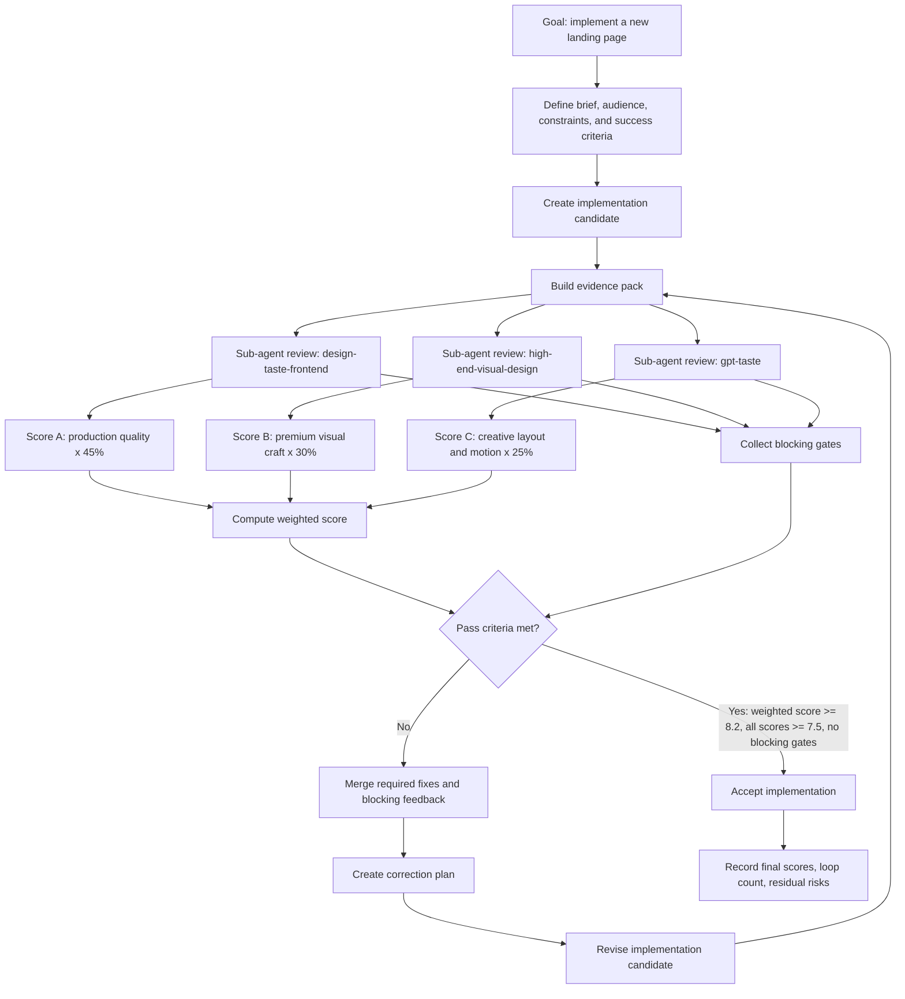
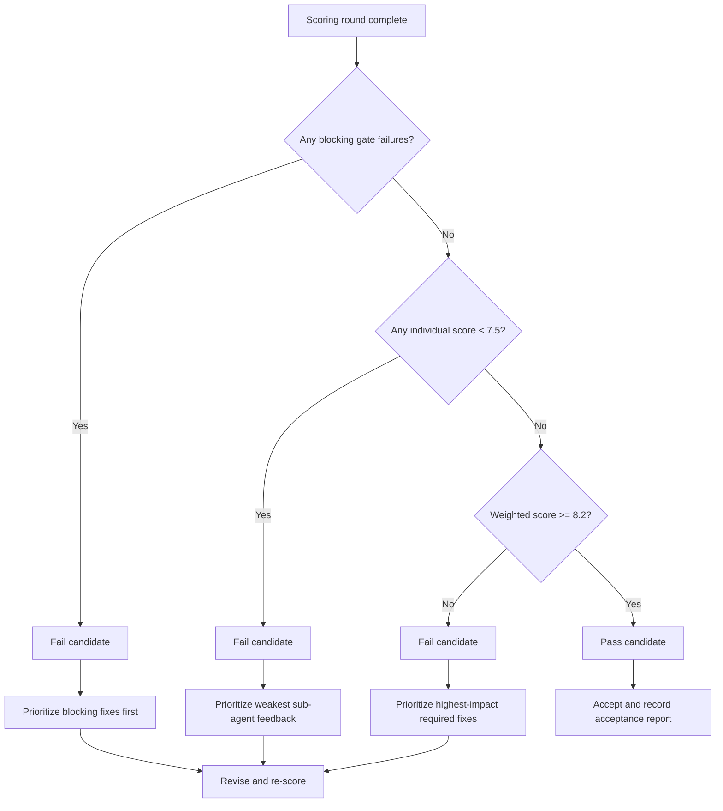

# Landing Page Implementation Scoring Protocol

This protocol defines how to evaluate a new landing page implementation with three specialist sub-agents, merge their feedback, and iterate until the implementation passes a minimum weighted quality threshold.

This is a documentation-only protocol. It does not authorize runtime changes, route changes, dependency changes, Supabase changes, package-lock changes, or changes to app behavior.

## Objective

Use three design-specialist sub-agents to score each landing page implementation candidate.

The implementation is accepted only when:

- The weighted score is at or above the pass threshold.
- No individual skill score is below the minimum floor.
- No blocking gate failure is present.

If the candidate fails, the feedback is merged into a correction plan, the implementation is revised, and the same scoring loop runs again.

## Protocol Diagram



## Decision Tree

Use this decision tree after every scoring round:



## Sub-Agent Roles

### 1. `design-taste-frontend`

Primary responsibility: production-quality landing page judgment.

Use this sub-agent to evaluate:

- Brief interpretation and audience fit.
- Landing page structure and anti-generic execution.
- Accessibility, contrast, responsiveness, and viewport behavior.
- Copy discipline and visible-string quality.
- Design-system consistency.
- Final pre-flight quality gates.

### 2. `gpt-taste`

Primary responsibility: creative layout and motion judgment.

Use this sub-agent to evaluate:

- AIDA structure.
- Hero strength and 2-line or 3-line discipline.
- Layout variance.
- Gapless bento and grid math.
- GSAP and scroll-motion quality.
- Avoidance of cheap meta-labels, repetitive section patterns, and generic compositions.

### 3. `high-end-visual-design`

Primary responsibility: premium craft and polish judgment.

Use this sub-agent to evaluate:

- High-end agency feel.
- Typography, spacing, visual hierarchy, and materiality.
- Double-bezel card and container craft where appropriate.
- CTA architecture and haptic micro-interactions.
- Motion smoothness and perceived quality.
- Mobile collapse quality for asymmetric layouts.

## Initial Weighting

Use this weighting as the starting point:

| Skill | Weight | Reason |
| --- | ---: | --- |
| `design-taste-frontend` | 45% | Broadest production coverage: brief fit, accessibility, copy, responsiveness, design-system choice, and final pre-flight discipline. |
| `high-end-visual-design` | 30% | Strongest influence on perceived premium quality: typography, spacing, materiality, interaction polish, and agency-grade finish. |
| `gpt-taste` | 25% | Raises creative ceiling through layout variance, AIDA structure, bento discipline, and advanced motion, while remaining balanced against usability. |

Weighted score formula:

```txt
weighted_score =
  (design_taste_frontend_score * 0.45) +
  (high_end_visual_design_score * 0.30) +
  (gpt_taste_score * 0.25)
```

## Pass Threshold

Default pass criteria:

```txt
weighted_score >= 8.2 / 10
minimum_individual_score >= 7.5 / 10
blocking_failures = 0
```

Interpretation:

- `8.2` is the minimal acceptable weighted score for a production landing page with premium design ambition.
- `7.5` is the floor that prevents one weak dimension from being hidden by the weighted average.
- Any blocking failure overrides the score and forces another implementation loop.

## Blocking Gates

Any blocking gate failure causes the implementation candidate to fail, even if the weighted score is high.

Blocking gates:

- Build failure.
- Runtime error on the landing page.
- Severe mobile layout break.
- Text overlap or clipped text.
- Horizontal page overflow.
- Primary CTA is unreadable or fails contrast.
- Hero does not fit the first viewport.
- Navigation wraps to multiple lines on desktop.
- Primary landing page visual asset is missing where the brief requires visual proof.
- Motion ignores reduced-motion requirements.
- Scroll or GSAP behavior breaks page usability.
- Accessibility failure on primary actions or forms.
- Implementation violates project rules, framework conventions, or brownfield constraints.
- Page uses repeated generic patterns strongly flagged by at least two sub-agents.

## Scoring Scale

Each sub-agent scores from `0` to `10`.

```txt
10 = exceptional, no meaningful issues
9 = production-ready with minor polish only
8 = good, but visible improvements remain
7 = usable, but below the premium landing page target
6 or lower = fails the protocol
```

Sub-agents should score harshly. A score above `8.5` should require strong evidence, not just lack of obvious defects.

## Required Evidence Pack

Before scoring, provide each sub-agent with the same evidence pack.

Evidence pack:

- Brief or implementation objective.
- Relevant changed files.
- Rendered screenshots for desktop and mobile, when available.
- Browser verification notes, when available.
- Build, typecheck, lint, or test command results, when relevant.
- Applicable project constraints from `AGENTS.md`.
- Implementation notes explaining important design choices.

If the evidence is incomplete, sub-agents must score conservatively and call out missing evidence.

## Sub-Agent Response Format

Each sub-agent must return this structure:

```json
{
  "skill": "design-taste-frontend",
  "score": 8.4,
  "blocking_failures": [],
  "required_fixes": [
    "Primary CTA contrast is too low in dark mode.",
    "Hero subcopy exceeds the target length.",
    "Two sections repeat the same split layout pattern."
  ],
  "polish_suggestions": [
    "Use a stronger first-viewport product signal."
  ],
  "confidence": "medium"
}
```

Response rules:

- `blocking_failures` must include only issues that force a fail.
- `required_fixes` must include the top issues needed to pass the next loop.
- `polish_suggestions` are optional improvements that should not block passing.
- `confidence` should be `low`, `medium`, or `high`, based on evidence quality.

## Iteration Loop

1. Generate or update the landing page implementation candidate.
2. Build the evidence pack.
3. Ask all three sub-agents to score the same candidate independently.
4. Parse each score, blocking failure list, required fix list, and polish list.
5. Compute the weighted score.
6. Apply the pass criteria.
7. If the candidate passes, accept the implementation.
8. If the candidate fails, merge feedback into a correction plan.
9. Re-implement only the necessary changes.
10. Build a fresh evidence pack.
11. Re-score with the same three sub-agents.
12. Repeat until the candidate passes.

## Self-Correcting Feedback Loop

The correction loop is intentionally narrow. Each failed round should produce a revised implementation that directly addresses the highest-impact evidence from the previous round.

Loop inputs:

- Blocking gate failures.
- Lowest individual sub-agent score.
- Required fixes from each sub-agent.
- Weighted-score gap from the `8.2` threshold.
- Evidence gaps called out through low or medium confidence.

Correction priority:

1. Fix all blocking gates.
2. Raise any individual score below `7.5`.
3. Address issues from the highest-weighted failing dimension.
4. Apply polish only after pass blockers and required fixes are resolved.

The loop ends only when the implementation passes all criteria in the same scoring round.

## Feedback Merge Rules

When feedback conflicts, use this priority order:

1. Project constraints and runtime correctness.
2. Blocking gates.
3. `design-taste-frontend` production-quality issues.
4. `high-end-visual-design` premium polish issues.
5. `gpt-taste` creative motion and layout issues.

Conflict examples:

- If `gpt-taste` asks for heavier motion but `design-taste-frontend` flags accessibility or performance risk, reduce the motion.
- If `high-end-visual-design` asks for more glass or blur but performance constraints are at risk, keep the materiality lighter.
- If `design-taste-frontend` passes structure but both visual sub-agents flag generic execution, revise the visual direction before accepting.

## Acceptance Report Format

When the implementation passes, record:

```txt
Final weighted score: 8.4 / 10

Skill scores:
- design-taste-frontend: 8.6
- high-end-visual-design: 8.3
- gpt-taste: 8.1

Blocking failures: none
Loops completed: 2
Accepted: yes
```

Also record the strongest remaining non-blocking risks, if any.

## Failure Report Format

When the implementation fails a loop, record:

```txt
Weighted score: 7.8 / 10

Skill scores:
- design-taste-frontend: 8.0
- high-end-visual-design: 7.6
- gpt-taste: 7.1

Blocking failures:
- Hero CTA is not visible without scrolling on mobile.

Required next fixes:
- Reduce hero vertical stack height.
- Rework CTA placement.
- Simplify the second and third sections to avoid repeated split layouts.

Accepted: no
Next action: revise implementation and re-score.
```

## Calibration Notes

Initial calibration:

```txt
design-taste-frontend: 45%
high-end-visual-design: 30%
gpt-taste: 25%
weighted threshold: 8.2 / 10
individual floor: 7.5 / 10
```

If future sessions show the protocol is too conservative:

- Lower the weighted threshold from `8.2` to `8.0`.
- Keep the individual floor at `7.5`.
- Do not remove blocking gates.

If future sessions show the protocol accepts visually bland pages:

- Increase `high-end-visual-design` from `30%` to `35%`.
- Increase `gpt-taste` from `25%` to `30%`.
- Reduce `design-taste-frontend` from `45%` to `35%`.
- Keep the weighted threshold at `8.2` or raise it to `8.4`.

If future sessions show the protocol over-optimizes for spectacle:

- Increase `design-taste-frontend` from `45%` to `50%`.
- Reduce `gpt-taste` from `25%` to `20%`.
- Keep `high-end-visual-design` at `30%`.

## Recommended Default

Use the initial calibration unless the product owner explicitly chooses a different optimization target.

Default optimization target:

```txt
Conversion-safe production quality with premium visual ambition.
```

Default scoring settings:

```txt
weights = {
  "design-taste-frontend": 0.45,
  "high-end-visual-design": 0.30,
  "gpt-taste": 0.25
}

threshold = 8.2
individual_floor = 7.5
blocking_gates_required = true
```
