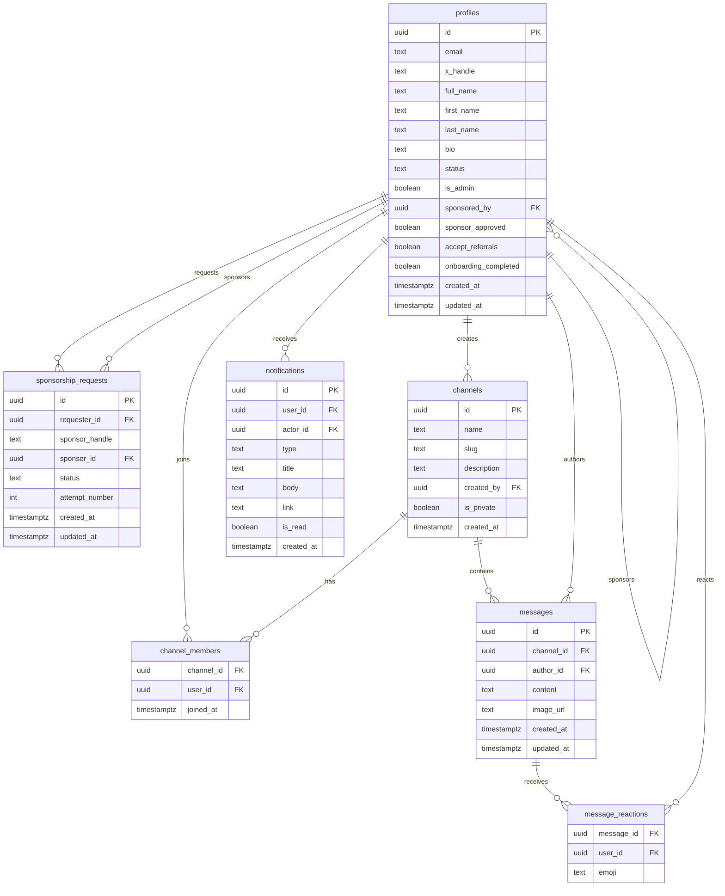

# TASK_02 - Generer `db_flow.md`

## Objectif

Creer `db_flow.md`, document de reference du schema Supabase actuel et cible MVP: tables, relations, RLS, risques et migrations necessaires.

## Triage - Priorite Et Plan

Priorite globale: P1 documentaire, a faire avant toute migration RLS.

| Item | Priorite | Effort | Risque | Critere |
| --- | --- | --- | --- | --- |
| Auditer migrations Supabase | P0 | M | Moyen | Tables, colonnes et policies inventoriees |
| Classer chaque table | P0 | S | Moyen | Aucune table connue non classee |
| Documenter RLS critiques | P0 | M | Eleve | Chaque risque P0 a table/policy concernee |
| Ecrire ERD Mermaid | P1 | S | Moyen | Diagramme valide avec noms reels |
| Separer actuel/cible | P1 | S | Eleve | Champs cible non existants marques comme migrations |
| Lister migrations necessaires | P1 | S | Moyen | Liste actionnable, non appliquee |

Prochaine action concrete: creer `db_flow.md` a la racine, base sur les migrations existantes, puis relire contre les criteres ci-dessous.

## Tables A Classer

### Garder MVP

- `profiles`
- `sponsorship_requests`
- `channels`
- `channel_members`
- `messages`
- `message_reactions` si reactions conservees
- `notifications`
- `countries`, `cities`, `specialty_categories`, `specialties` si encore utiles onboarding/profil

### Adapter

- `profiles`: proteger colonnes sensibles.
- `sponsorship_requests`: imposer demande pending valide et parrain unique actif.
- `channels`: admin-only pour creation canaux publics; exception DM a cadrer.
- `channel_members`: empecher insertion arbitraire.
- `messages`: Jobs admin-only, membership DM, pin/soft delete/edit.
- `message_reactions`: verifier acces au message/channel.
- `notifications`: aligner types et creation systeme.

### Archiver Plus Tard

- `forum_categories`
- `forum_posts`
- `forum_replies`
- `forum_tags`
- `forum_post_tags`
- `channel_proposals`
- `channel_votes`
- `annonces`
- `offres_emploi`
- `invitations` si remplace par `sponsorship_requests`, a ne pas supprimer avant audit.

## ERD Mermaid Attendu

Utiliser les noms reels connus, pas des noms generiques.

## RLS P0 A Auditer

- `profiles`: la policy self-update ne doit pas permettre `status`, `is_admin`, `sponsored_by`, `sponsor_approved`, `chat_banned`, `chat_muted_until`.
- `sponsorship_requests`: insert requester doit forcer `status='pending'`, requester courant, sponsor valide, pas self-sponsor.
- `messages`: insert doit verifier auteur courant, status approved, acces au channel, Jobs admin-only.
- `channel_members`: insert ne doit pas permettre de rejoindre/ajouter arbitrairement un channel prive.
- `message_reactions`: ne doit pas fuiter les reactions des channels prives.
- `notifications`: un client ne doit pas pouvoir notifier arbitrairement n'importe quel `user_id`.
- `invitations`: insert doit forcer `inviter_id = auth.uid()` si la table reste active.

## Migrations A Identifier

- Bootstrap admins avec garde `count = 2`.
- RLS/protections colonnes sensibles `profiles`.
- Index partiel pour une seule demande de parrainage active par requester.
- Check ou trigger anti self-sponsor.
- `messages.is_pinned` et champs soft delete/edit si confirmes par `TASK_09`.
- Alignement `notifications.type` avec le set minimal: `welcome`, `sponsor_request`, `account_approved`, `chat_mention` si deja present.
- Canaux initiaux et eventuel `channels.sort_order` si l'ordre stable est requis.

## Critères De Completion

- `db_flow.md` existe.
- Le document separe clairement schema actuel et schema cible MVP.
- Chaque table est classee `keep`, `adapt`, `archive later`, ou `unknown`.
- Les relations Mermaid utilisent les noms reels de colonnes.
- Les risques RLS critiques sont explicites.
- Les migrations sont listees sans les appliquer.
- Les suppressions destructives sont reportees.

## Risques

- Escalade via `profiles` self-update.
- Ecriture dans DMs prives par ID connu.
- Notifications systeme actuellement bloquees ou incoherentes.
- RLS recursive sur `channel_members`.
- Confondre parrain unique par candidat avec un seul filleul par parrain.

## Temoin - Corrections Integrees

- Garder les noms reels: `x_handle`, `author_id`, `user_id`, `sponsor_handle`.
- Le parrain unique signifie un sponsor par candidat, pas un candidat par sponsor.
- Ne pas empiler des policies contradictoires; remplacer les policies permissives.
- Inclure `welcome`/RLS notifications comme risque critique.
