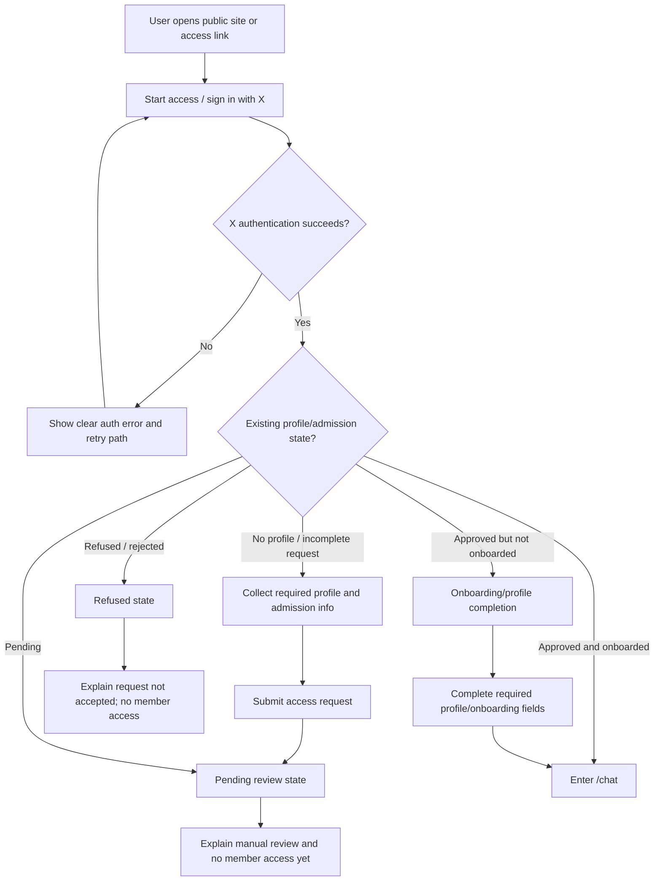
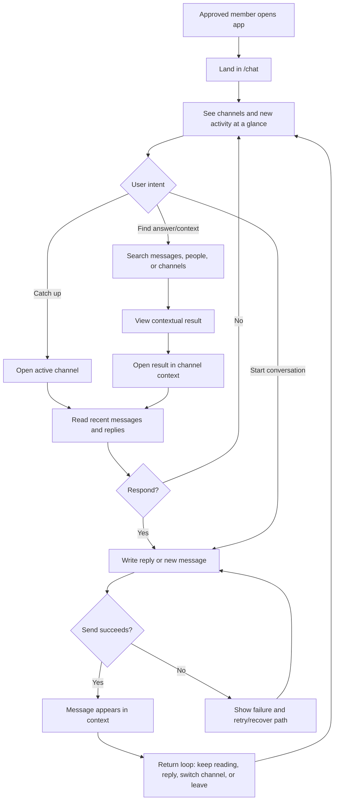
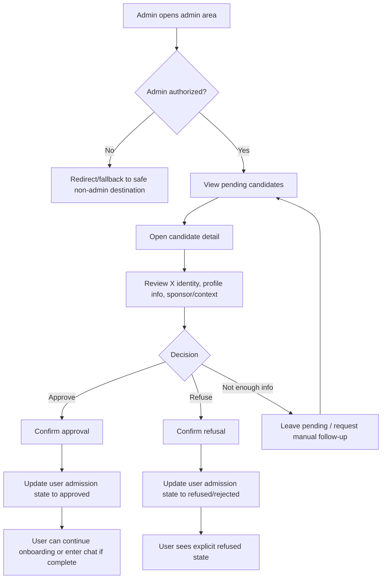
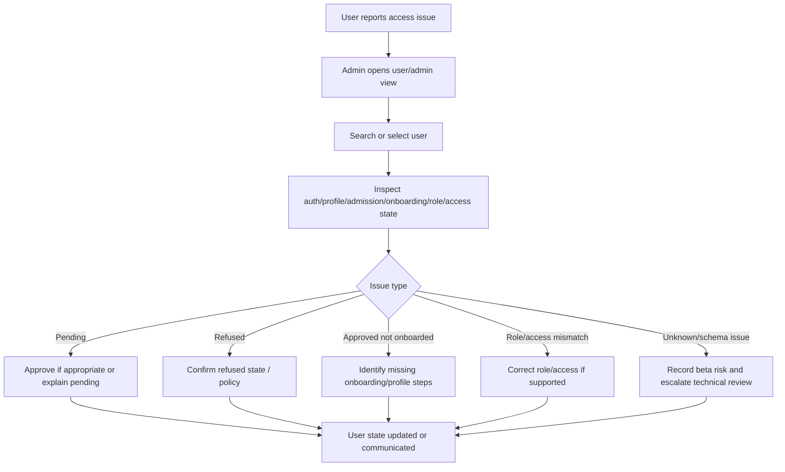

---
stepsCompleted:
  - 1
  - 2
  - 3
  - 4
  - 5
  - 6
  - 7
  - 8
  - 9
  - 10
  - 11
  - 12
  - 13
  - 14
lastStep: 14
status: complete
inputDocuments:
  - _bmad-output/planning-artifacts/prd.md
  - _bmad-output/planning-artifacts/brownfield-mvp-speckit-distillate.md
  - _bmad-output/project-context.md
  - design-system/marchélibre/MASTER.md
documentNotes:
  - design-system/marchélibre/MASTER.md is legacy/non-binding reference material; validate any adopted patterns against the current MVP product direction.
---

# UX Design Specification webapp-nextjs

**Author:** Maxime
**Date:** 2026-04-30

---

<!-- UX design content will be appended sequentially through collaborative workflow steps -->

## Executive Summary

### Project Vision

Le Marche Libre is a private French-first club for liberals and entrepreneurs, currently focused on stabilizing a brownfield Next.js/Supabase prototype into a controlled closed-beta web app. The MVP is a migration chamber from a proven but hard-to-manage X group into a clearer, safer, chat-centered private community.

The UX direction should prioritize trust, clarity, and operational simplicity over broad platform expansion. The product should feel like a curated private club with a familiar X-native identity layer, not a generic open social network or an overbuilt SaaS dashboard.

### Target Users

The primary users are existing or invited members from Maxime's X-native community who value a trusted liberal and entrepreneurial private space but find the current large X group noisy and difficult to follow.

Key user groups include pending candidates who need clear review-status feedback, refused candidates who need a firm but understandable boundary, approved members who need a simple chat-centered community experience, and owner/admin users who need reliable admission, role, access, and channel controls without relying on direct Supabase edits.

### Key Design Challenges

- Make admission states unmistakable: pending, refused, approved, blocked, and approved-not-onboarded users must always understand what is happening and what they can or cannot do.
- Re-center the product around chat while de-emphasizing legacy forum, annuaire, jobs/offers, proposals, and broad discovery surfaces.
- Preserve a private-club feel: public pages must set closed-beta/manual-review expectations and avoid implying open self-service access.
- Keep the UX brownfield-safe: recommendations should support the existing MVP stabilization path rather than require a full redesign before beta.
- Support French-first user-facing copy while remaining i18n-compatible for future localization.
- Make admin operations understandable enough to reduce manual database intervention during beta.

### Design Opportunities

- Turn the X group migration into a clear product advantage: familiar identity, trusted admission, and better topic separation than a single chaotic group chat.
- Use explicit status screens and routing feedback to make the private-club boundary feel intentional rather than broken.
- Make `/chat` the obvious app home with lightweight channel navigation, member trust cues, and low-friction participation.
- Create a calm, credible visual language using the useful parts of the legacy design reference: clean layout, navy/blue palette, readable typography, strong contrast, visible focus states, and responsive behavior.
- Design admin review and troubleshooting flows as beta operations tools, not as a complex back-office platform.

## Core User Experience

### Defining Experience

The defining experience of Le Marche Libre is a trusted private social chat where approved members can quickly understand what happened, find relevant answers or messages, and contribute new messages without friction.

The product should optimize for the daily social loop: land in the app, see what is new, understand which conversations matter, read replies or relevant messages, and write a message in the right channel. Because this is a social app, the interaction layer is the product: navigation, message visibility, replies, search, composing, and feedback must feel direct and reliable.

The core interaction to get right is not a complex dashboard or marketplace flow. It is the moment an approved member opens the app and immediately knows where to read, where to respond, and how to participate.

### Platform Strategy

The MVP is a responsive web app built on the existing Next.js/Supabase brownfield architecture. It should work well on both desktop and mobile browsers, with special attention to mobile entry from X links.

The primary interaction mode should support both touch and mouse/keyboard. Mobile should make reading, scanning new activity, replying, and composing messages easy with one-handed patterns where practical. Desktop should support faster scanning, search, and longer message composition.

Offline functionality is not an MVP requirement. Reliability, correct admission routing, and responsive chat interactions matter more than app-like offline behavior.

### Effortless Interactions

The following interactions should require minimal thought:

- Landing in the app and immediately seeing new or relevant activity.
- Understanding unread messages, replies, mentions, or important updates at a glance.
- Opening the right channel or conversation context.
- Searching for answers, people, or previous relevant messages.
- Reading message context without losing place.
- Writing and sending a new message.
- Replying to an existing message.
- Recovering from admission states without confusion: pending, refused, approved-not-onboarded, or blocked.

The UX should reduce ambiguity around where the user is, what is new, who is speaking, what channel they are in, and whether their message was sent.

### Critical Success Moments

The first critical success moment is when an approved member lands in `/chat` and instantly recognizes that this is a cleaner, more manageable replacement for the X group.

The second is when the member can find relevant conversation context, either through visible new activity, replies, channel navigation, or search.

The third is when writing a new message feels immediate and safe: the user knows where they are posting, can compose without friction, receives clear send feedback, and sees their message appear in context.

The make-or-break flows are X-authenticated entry, admission-state routing, approved-member chat entry, new activity scanning, reply/search context, and message sending.

### Experience Principles

- Chat is the center: every approved-member path should make `/chat` feel like the natural home of the app.
- Interaction is the product: message reading, searching, replying, and composing must be direct, reliable, and low-friction.
- Make new activity visible: users should know at a glance what changed and where attention is needed.
- Preserve context: search results, replies, mentions, and channel navigation should help users understand conversation history without disorientation.
- State must be explicit: pending, refused, onboarding, approved, blocked, and admin states must never feel like broken routing.
- Architecture should serve the loop: routing, realtime behavior, channel protocol, message model, and search should be chosen to make the social interaction loop coherent and durable.

## Desired Emotional Response

### Primary Emotional Goals

Le Marche Libre should make approved members feel excited to open the app and check what is happening. The emotional target is light dopamine from social activity: new messages, replies, relevant discoveries, and the sense that the private group is alive.

The experience should not feel boring, empty, bureaucratic, or overwhelming. Members should feel social satisfaction: they can see what others are saying, find useful answers, contribute something, and receive replies inside a trusted group.

The product should feel socially familiar like Discord or WhatsApp groups, while visually and culturally staying close to X. The user should recognize the rhythm of social conversation without feeling like they are entering a complex server-management tool.

### Emotional Journey Mapping

When users first discover the product, they should feel curiosity and selective access: this is a private club, not a public forum.

When approved members open the app, they should feel immediate social pull: there are new messages, active people, and relevant conversations worth checking.

During the core experience, users should feel oriented and engaged. They should know what is new, where replies are, where to search, and where to write.

After finding a relevant answer or message, users should feel satisfied and in control, not lost in an endless stream.

After writing or receiving replies, users should feel socially rewarded: the interaction landed, the group responded, and the app is worth returning to.

Pending or refused candidates should feel blocked but not punished. The tone can be a little amused or light, but must avoid frustration, confusion, or broken-routing feelings.

### Micro-Emotions

The most important emotional states are:

- Excitement over boredom.
- Social satisfaction over passive consumption.
- Orientation over confusion.
- Manageable activity over overwhelm.
- Belonging over isolation.
- Amused patience over frustration for pending/refused states.
- Familiarity over novelty for core chat interactions.

### Design Implications

To create excitement without overwhelm, the app should make new activity visible at a glance without turning the interface into a noisy dashboard.

To create social satisfaction, replies, mentions, message feedback, and visible participation should feel immediate and recognizable.

To preserve familiarity, chat behavior should borrow from Discord and WhatsApp group expectations: channels, unread states, replies, composer, lightweight social feedback, and fast return loops.

To visually connect with the existing X-native community, the interface can borrow X-like density, profile/avatar prominence, timeline-like message scanning, and familiar social affordances, while avoiding direct copying.

To keep pending/refused users amused rather than frustrated, status pages should be explicit, human, and slightly warm, with no redirect loops or dead ends.

### Emotional Design Principles

- Make the app feel alive quickly.
- Reward social participation with clear replies, visible message state, and easy return loops.
- Keep activity stimulating but not chaotic.
- Make the chat model familiar before making it novel.
- Preserve X-native visual familiarity while improving structure and clarity.
- Treat blocked states with clarity and lightness, never with ambiguity.

## UX Pattern Analysis & Inspiration

### Inspiring Products Analysis

X is the strongest visual and cultural reference for Le Marche Libre. It succeeds because it combines many user jobs in one familiar social surface: news, tech discussion, posting, sharing, profile identity, social proof, and fast discovery. Its key UX strength is speed: users can scan, post, reply, share, and follow context with little ceremony. For Le Marche Libre, the transferable lesson is not to copy X wholesale, but to preserve X-native familiarity, social density, profile/avatar prominence, and low-friction posting.

WhatsApp is the reference for efficiency and ease of use. It succeeds because the interaction model is obvious: open the app, see conversations, read what changed, reply, and leave. It minimizes visible complexity and makes messaging feel direct. For Le Marche Libre, the transferable lesson is that core chat actions should require almost no explanation, especially on mobile.

LinkedIn is useful as a reference for discovering professional and social relations. Its strength is relationship context: who someone is, what they do, mutual connections, credibility signals, and discovery through profiles. For Le Marche Libre, the transferable lesson is selective member context: profiles and search should help members understand who they are speaking with and why that person matters inside the private club.

Discord is a strong reference for richer group interaction. It succeeds with channels, active community feel, widgets, commands, interaction affordances, and an interface that can support both fast chat and more structured community behavior. For Le Marche Libre, the transferable lesson is channel-based group organization and expressive interaction patterns, but simplified for the MVP so it does not become overwhelming.

### Transferable UX Patterns

Navigation patterns to adapt:

- X-like primary social surface: dense, familiar, avatar-led message scanning that keeps conversation and identity close together.
- WhatsApp-like conversation return loop: open app, see what changed, jump into the relevant conversation, reply quickly.
- Discord-like channel structure: admin-defined channels make the community easier to follow than one large X group.
- LinkedIn-like profile context: lightweight identity cards and relationship cues help members trust who they are speaking with.

Interaction patterns to adapt:

- Fast composer always close to the conversation.
- Clear unread/new activity indicators.
- Replies and mentions that preserve context.
- Search that helps users find answers, people, and previous messages.
- Profile previews or member details that expose useful X/professional context without turning the app into a full annuaire.
- Lightweight interaction affordances from Discord, but only where they support the chat loop.

Visual patterns to adapt:

- X-like social density, avatars, profile handles, and feed readability.
- WhatsApp-like simplicity for message list and composer behavior.
- Discord-like channel/sidebar structure where useful, especially on desktop.
- LinkedIn-like credibility cues for profiles, but simplified and private-club appropriate.
- Clean navy/blue visual foundation from the legacy design reference only where it supports clarity and trust.

### Anti-Patterns to Avoid

- Copying Discord complexity too early: too many widgets, commands, panels, badges, or nested interaction layers would overwhelm the MVP.
- Rebuilding LinkedIn/annuaire: member discovery should support trust and conversation, not become a standalone professional network.
- Becoming a generic SaaS dashboard: the app should feel social and alive, not administrative.
- Hiding chat behind navigation: approved members should land naturally in the chat loop.
- Making search only a channel shortcut: users need answers, people, message context, and relevant past conversation.
- Overloading the public landing with future features: X/LinkedIn-like breadth should not imply open access or parked marketplace features.
- Creating X-level chaos: the product should preserve familiar social energy while improving structure and reducing noise.

### Design Inspiration Strategy

What to adopt:

- X's social familiarity, fast posting rhythm, profile/avatar prominence, and scan-friendly message density.
- WhatsApp's efficiency and obvious messaging loop.
- Discord's channel organization and rich interaction affordances.
- LinkedIn's relationship-discovery and credibility cues.

What to adapt:

- Adapt X-like visual language to a private, calmer, higher-trust environment.
- Adapt Discord channels without importing full server complexity.
- Adapt WhatsApp simplicity to group channels rather than private chats only.
- Adapt LinkedIn profile context into lightweight member trust cues rather than a full professional network.

What to avoid:

- Do not let Discord-style feature richness outrun the brownfield MVP.
- Do not make the product feel like a generic forum or business directory.
- Do not copy X's noise, algorithmic distraction, or public-broadcast feeling.
- Do not make LinkedIn-style networking the main product before the chat loop is proven.

## Design System Foundation

### 1.1 Design System Choice

For the MVP, Le Marche Libre will use the existing project UI foundation rather than introducing a new design system or performing a redesign.

The design system approach is brownfield-preservation first: keep current Tailwind styles, existing UI primitives, existing layouts, and current component patterns wherever they are usable. Define only a small product-specific UX layer for the beta-critical surfaces: chat, admission status screens, onboarding/profile completion, member identity cues, and admin review.

A broader UX/UI redesign is explicitly deferred to post-MVP work, after the closed-beta loop has been stabilized and real user behavior has been observed.

### Rationale for Selection

The MVP is under emergency stabilization constraints. Speed, safety, and working beta-critical flows matter more than visual uniqueness.

Introducing a new component library or rebuilding the visual system would create unnecessary risk before beta. The current app is brownfield and already contains many implemented surfaces, so the safest design system decision is to reuse what exists, reduce inconsistency only where it blocks the MVP, and avoid broad refactors.

The product still needs a clear UX direction: chat should feel socially alive and familiar, with inspiration from X, WhatsApp, and Discord. However, that direction should be expressed through small refinements and prioritized flow fixes, not a full redesign.

The legacy `design-system/marchélibre/MASTER.md` file may remain a reference for general visual tone and accessibility checks, but it is not a binding design authority for the MVP.

### Implementation Approach

The MVP implementation should:

- Reuse existing Tailwind classes, shared components, layouts, and UI primitives.
- Avoid adding a new design system package or replacing the component stack.
- Make minimal, targeted improvements only where beta-critical UX is unclear or broken.
- Prioritize chat usability, admission-state clarity, and admin operational clarity.
- Preserve current visual language unless a specific screen conflicts with MVP goals.
- Document larger UX/UI redesign ideas as post-MVP candidates rather than launch blockers.

### Customization Strategy

Customization should focus on the smallest layer needed to make the MVP coherent:

- Chat: improve clarity around channels, unread/new activity, replies, search, composer, and message state.
- Admission states: make pending, refused, approved-not-onboarded, and blocked states explicit and human.
- Member identity: preserve X-native cues such as avatar, handle, display name, and profile context.
- Admin review: make candidate status, role, approval/refusal, and access troubleshooting understandable.
- Public landing/access: ensure copy and calls to action match the closed-beta/private-club promise.
- Accessibility: keep readable contrast, visible focus states, semantic controls, and mobile-safe layouts.

Post-MVP, the team can revisit the full UX/UI system using beta evidence, including whether to formalize a distinct Le Marche Libre visual identity, refine the chat architecture, and redesign broader member/admin experiences.

## 2. Core User Experience

### 2.1 Defining Experience

The defining experience of Le Marche Libre is: participate in high-signal conversations without X group chaos.

Members should feel that they are interacting with people they already know or recognize from social media, especially X, but in a calmer private space without the noise, distractions, public performance pressure, algorithmic feed dynamics, or off-topic overload of social media.

The core action is opening the app, quickly seeing what matters in the private group, and joining the right conversation. The app should preserve the immediacy and social familiarity of X while making discussion more structured, trusted, and easier to follow.

### 2.2 User Mental Model

Users currently solve this problem through X, X group chats, WhatsApp groups, Discord servers, LinkedIn, and direct social media interactions. They bring expectations from these tools:

- From X: fast scanning, handles, avatars, social identity, posting, replies, and public conversation rhythm.
- From WhatsApp: simple messaging, obvious unread states, quick replies, and low-friction return loops.
- From Discord: channels, community energy, richer interaction patterns, and topic separation.
- From LinkedIn: relationship discovery, credibility cues, and professional/social context.

Their mental model is not “manage a dashboard.” It is “enter a private social room, see what people are saying, and participate.”

Likely frustration points are noise, too many surfaces, unclear new activity, losing message context, bad search, confusing admission states, and interactions that feel like a forum rather than live social conversation.

### 2.3 Success Criteria

The defining experience succeeds when:

- Approved members land in chat and immediately understand what is new or important.
- Members can find relevant messages, answers, or people without digging through a chaotic feed.
- Members know which channel or conversation context they are in.
- Sending a message or reply feels immediate, familiar, and reliable.
- The app feels alive but not overwhelming.
- The private club boundary feels intentional and trusted.
- Users feel they can keep social media relationships active without social media noise.

A user should be able to say: “I can talk with the people I follow from X, but here it is calmer, cleaner, and easier to follow.”

### 2.4 Novel UX Patterns

The MVP should rely mostly on established UX patterns rather than novel interaction design.

Established patterns to use:

- X-like identity and message scanning.
- WhatsApp-like conversation simplicity.
- Discord-like topic channels.
- LinkedIn-like lightweight relationship context.

The unique combination is the product: a private X-native club chat with structured channels and reduced noise. The UX should feel familiar enough that users do not need training, while the improved structure creates the differentiation.

The MVP should avoid inventing new interaction protocols unless required by the current architecture. Novelty should come from community quality, privacy, curation, and reduced noise, not from unfamiliar controls.

### 2.5 Experience Mechanics

Initiation:

- The approved member opens the app and lands naturally in `/chat`.
- The interface shows new activity, active/relevant channels, and enough member identity context to feel socially alive.
- The user can immediately choose whether to catch up, search, reply, or write.

Interaction:

- The user scans channel activity and message context.
- The user opens a channel or relevant result.
- The user reads messages, replies, mentions, or past context.
- The user writes a new message or reply using a composer close to the conversation.
- The system provides clear feedback that the message is sending, sent, or failed.

Feedback:

- Unread/new activity indicators show what changed.
- Replies and mentions preserve context.
- Search results expose the relevant message, channel, person, and surrounding context.
- Message send state is visible enough to avoid uncertainty.
- Admission and blocked states explain what is happening instead of feeling like routing bugs.

Completion:

- The user sees their message appear in the right context.
- The user feels socially rewarded when others reply or when they find useful information.
- The next action is obvious: keep reading, reply, search, switch channel, or leave and return later.

## Visual Design Foundation

### Color System

For the MVP, Le Marche Libre will keep the current implemented color palette and visual styling. The priority is launch stability and speed, not a palette redesign.

The current palette should be preserved unless a specific color choice creates a beta-critical usability problem, such as unreadable text, unclear action hierarchy, invisible focus state, or confusing admission/status feedback.

Post-MVP, the product should evolve toward an X-like social UI with robust light and dark mode support. The desired future direction is closer to X’s familiar social interface than to a generic SaaS dashboard, while still preserving the private-club identity and reduced-noise experience.

The legacy design-system palette may remain historical reference only. It should not override the current implemented palette during MVP stabilization.

### Typography System

For the MVP, keep the current typography and text styling. Do not introduce new fonts, global typography changes, or broad type-scale revisions before beta unless a readability issue blocks a critical flow.

Typography should support fast social scanning in chat: readable names, handles, timestamps, message bodies, replies, channel labels, and status text. The system should avoid overly decorative or brand-heavy typography that slows down comprehension.

Post-MVP, typography can be revisited as part of a broader X-like visual direction. Plus Jakarta Sans from the legacy design reference can be considered, but it is not an MVP requirement.

### Spacing & Layout Foundation

For the MVP, preserve current layout patterns and spacing where they are usable. The main visual adjustment direction is not “more beautiful,” but “less confusing and more socially readable.”

Chat should bias toward denser social readability where feasible, closer to X/Discord message scanning than spacious SaaS cards. This does not require a redesign; it means avoiding unnecessary empty space or dashboard-like layouts in beta-critical chat interactions.

Layout priorities:

- `/chat` should feel like the primary social surface.
- New activity, channels, replies, search, and composer should be easy to locate.
- Mobile layouts should prioritize reading and writing messages.
- Desktop layouts can support stronger channel/sidebar scanning.
- Admission and blocked states should be clear, centered, and human without adding visual complexity.
- Admin views should remain operational and legible rather than visually ambitious.

### Accessibility Considerations

MVP visual decisions must preserve practical accessibility:

- Text must remain readable on current backgrounds.
- Primary actions must be visually distinct.
- Focus states should remain visible for keyboard users.
- Pending, refused, onboarding, approved, and blocked states must be communicated in text, not only color.
- Touch targets in chat and admission flows should remain usable on mobile.
- Future dark mode should be designed deliberately, not patched in casually during MVP stabilization.

The post-MVP visual direction should include a proper light/dark theme strategy inspired by X-like social interfaces.

## Design Direction Decision

### Design Directions Explored

For MVP, no new design direction mockups are required. The team explicitly chose to preserve the current implemented visual direction due to emergency MVP timeline constraints.

The design exploration is deferred to post-MVP, where the product should move toward an X-like social UI with a strong light/dark experience.

### Chosen Direction

MVP direction: current UI preserved, with only minimal targeted improvements for beta-critical usability.

Post-MVP direction: X-like private social interface, with familiar social density, profile/avatar prominence, chat-first rhythm, and deliberate light/dark mode.

### Design Rationale

The MVP needs stability, not visual exploration. Generating and comparing multiple visual directions would create distraction and implementation risk. The correct design decision is to protect the beta launch path while recording the future direction.

### Implementation Approach

For MVP:

- Keep current palette, typography, components, and layouts.
- Avoid visual redesign.
- Improve only beta-critical clarity issues in chat, admission states, onboarding, and admin review.
- Treat any broader UI/UX redesign as post-MVP.

For post-MVP:

- Explore X-like light/dark social UI.
- Revisit chat density, message layout, profile identity cues, and navigation.
- Consider formalizing a refreshed design system after observing beta usage.

## User Journey Flows

### Admission Flow: X Sign-In to Chat Access

This flow covers the critical path from public access to the correct admission outcome. The UX priority is explicit state handling: users should always know whether they are pending, refused, approved but not onboarded, or approved and ready for chat.

UX requirements:

- Pending and refused states must feel intentional, not like broken routing.
- Refused copy should be firm, human, and optionally lightly amused, without exposing database terms like `rejected`.
- Approved users should not be trapped in onboarding loops.
- Approved onboarded users should naturally land in `/chat`.

### Core Chat Flow: Catch Up, Find Context, Participate

This is the defining product loop: participate in high-signal conversations without X group chaos.

UX requirements:

- New activity must be visible without overwhelming the user.
- Search should return messages, people, and context, not only channels.
- Replies and mentions should preserve conversation context.
- The composer should be close to the conversation and feel immediate.
- Send state should be visible enough to avoid uncertainty.

### Admin Review Flow: Candidate Admission Decision

This flow supports manual one-by-one admission while reducing direct database dependence.

UX requirements:

- Admin must see enough context to recognize the candidate.
- Approval/refusal actions must be clear, deliberate, and protected.
- State changes should be attributable where the schema supports it.
- Non-admins must not access or execute admin actions.
- Reversal policy should not be improvised before product decision.

### Admin Access Problem Flow: Troubleshoot User State

This flow covers beta operations when a user says they cannot access chat.

UX requirements:

- Admin should not need direct Supabase edits for normal beta operations.
- The admin view should expose status, role, onboarding/profile completion, and access state.
- If the app cannot resolve an issue, the limitation should be recorded as a beta operational risk.
- Troubleshooting must distinguish product state problems from technical/schema problems.

### Journey Patterns

Common navigation patterns:

- Approved users should route toward `/chat` by default.
- Pending/refused/onboarding states should use explicit status boundaries.
- Admin users need a separate operational path, but non-admin fallback should return safely to `/chat`.

Common decision patterns:

- User state determines access: logged out, pending, refused, approved-not-onboarded, approved-onboarded, admin, non-admin.
- Admin actions should require deliberate confirmation for approve/refuse/access-changing decisions.
- MVP flows should avoid hidden state transitions that make users feel lost.

Common feedback patterns:

- Always explain why the user can or cannot access the app.
- Show message send/retry state in chat.
- Show enough context around search results, replies, and mentions.
- Show admin action outcomes clearly: approved, refused, unchanged, failed, or needs technical follow-up.

### Flow Optimization Principles

- Get approved members to `/chat` quickly.
- Make new activity and relevant context visible without recreating X-level chaos.
- Keep admission-state language human and explicit.
- Preserve context when users search, open replies, or follow mentions.
- Keep admin workflows operational and low-risk rather than visually ambitious.
- Prefer familiar patterns from X, WhatsApp, Discord, and LinkedIn over novel interaction design.
- Treat unresolved schema or authorization uncertainty as beta risk, not UX ambiguity.

## Component Strategy

### Design System Components

For MVP, Le Marche Libre should use the existing project UI foundation first. Existing Tailwind styles, shared components, layout structures, and UI primitives should be reused wherever they are sufficient.

The component strategy is not to introduce a new component library or rebuild the design system. The goal is to identify the beta-critical product components required by admission, chat, and admin operations, then reuse or minimally refine existing implementation patterns.

### Custom Components

The following are MVP component requirements. They do not automatically imply new component builds; if an existing component or pattern already satisfies the need, it should be reused.

#### Admission Status Screen

**Purpose:** Explain pending, refused, blocked, and approved-not-onboarded states clearly.

**Usage:** Admission routing, `/en-attente`, refused state, onboarding boundary, and protected-route fallback states.

**States:** Pending review, refused/rejected, approved but onboarding required, logged-out/auth error, blocked/no access.

**Accessibility:** State must be expressed in text, not only color or iconography. Primary next action must be keyboard reachable.

#### Chat Channel List

**Purpose:** Help approved members see channels and new activity at a glance.

**Usage:** Main `/chat` navigation on desktop and mobile.

**States:** Active channel, unread/new activity, empty channel, loading, unavailable/error.

**Accessibility:** Channel entries should be semantic links or buttons with clear active/current state.

#### Message Item

**Purpose:** Display social messages with identity, context, and readable content.

**Usage:** Channel message feed, replies, mentions, search result context.

**Anatomy:** Avatar, display name, X handle when available, timestamp, message body, reply/context marker, send/edit/error state where relevant.

**States:** Normal, own message, sending, sent, failed, edited, deleted/tombstone, reply target, mentioned/highlighted.

#### Message Composer

**Purpose:** Let members write and send messages or replies with minimal friction.

**Usage:** Channel bottom composer and reply flows.

**States:** Empty, focused, typing, sending, sent, failed/retry, disabled/no permission.

**Accessibility:** Input must be keyboard usable, send action clear, and failure recoverable.

#### Search Result Item

**Purpose:** Help users find answers, people, channels, and previous messages with context.

**Usage:** Chat search and global message/member lookup.

**Variants:** Message result, person/member result, channel result.

**Content:** Matched text, channel/person context, timestamp where relevant, and enough surrounding context to avoid disorientation.

#### Candidate Review Row / Detail

**Purpose:** Support admin admission decisions without direct database edits.

**Usage:** Admin pending-candidate list and candidate detail surfaces.

**Content:** X identity, avatar, handle, profile information, sponsor/context, current admission state, relevant timestamps where available.

**Actions:** Approve, refuse, leave pending, inspect profile/context.

#### User Status Inspector

**Purpose:** Help admins troubleshoot beta access issues.

**Usage:** Admin user detail or troubleshooting view.

**Content:** Admission state, onboarding/profile completion, role, access/suspension state where supported, and technical risk note if state cannot be resolved from UI.

### Component Implementation Strategy

- Reuse existing components and patterns before creating anything new.
- Prefer small refinements in beta-critical components over broad abstractions.
- Do not introduce a new component library before MVP.
- Build or extract custom components only when repeated usage or clarity requires it.
- Keep component states explicit for admission, chat send/retry, search context, and admin actions.
- Preserve accessibility basics: semantic controls, visible focus, readable text, and recoverable errors.

### Implementation Roadmap

Phase 1 - Beta-critical clarity:

- Admission status screen requirements for pending/refused/onboarding/blocked states.
- Chat channel list clarity for active channel and new activity.
- Message item and composer states for read/write/send/retry.
- Candidate review row/detail for approve/refuse operations.

Phase 2 - Beta operations support:

- Search result item with contextual message/person/channel results.
- User status inspector for access troubleshooting.
- Admin action feedback patterns for approved, refused, unchanged, failed, or needs technical follow-up.

Phase 3 - Post-MVP refinement:

- Revisit component structure as part of a broader X-like UI redesign.
- Formalize light/dark mode component behavior.
- Consider richer Discord-like interaction affordances only after the core beta loop is stable.

## UX Consistency Patterns

### Button Hierarchy

Primary actions should be visually clear and reserved for the main next step in each flow.

Primary actions include:

- Sign in with X.
- Submit access request.
- Complete onboarding/profile.
- Send message.
- Approve candidate.

Secondary actions include navigation, cancel, back, view details, or leave pending.

Serious or potentially destructive actions, such as refuse candidate, suspend/remove access, or delete message, should require deliberate confirmation and should not visually compete with the main positive action.

### Feedback Patterns

Feedback must make system state explicit, especially for admission, chat, and admin operations.

Admission feedback should clearly explain pending, refused, approved-not-onboarded, blocked, and auth-error states. These states must not feel like redirect bugs.

Chat feedback should clearly show sending, sent, failed, retry, empty channel, and loading states where supported by the existing implementation.

Admin feedback should clearly show whether an action approved, refused, failed, did nothing, or requires technical follow-up.

### Form Patterns

Forms should be short, direct, and state why the requested information matters.

Admission and onboarding forms should collect only information needed for X identity checking, manual admission, member recognition, sponsor/parrain tracking, and beta operations.

Validation should be inline where practical, with errors written in user-facing language rather than technical schema language.

For MVP, forms should avoid complex multi-step redesign unless the current implementation creates blocking confusion.

### Navigation Patterns

Approved and onboarded users should route naturally to `/chat`.

Approved but not onboarded users should route to onboarding/profile completion.

Pending users should route to an explicit pending state.

Refused users should route to an explicit refused state.

Logged-out users should reach public/auth-appropriate routes only.

Non-admin users who attempt admin access should be routed safely, preferably back to `/chat` if they are approved members.

Navigation should avoid hidden loops, unclear fallbacks, and forum-centered defaults.

### Loading and Empty States

Loading states should reassure users that the app is working, especially during auth, admission-state checks, chat loading, and admin review loading.

Empty states should explain what is empty and what the user can do next.

Important empty states include:

- No messages in a channel.
- No pending candidates.
- No admin-visible data available.
- Onboarding/profile data missing.
- Chat temporarily unavailable.

Empty states should be calm and human, not overly playful during critical access or admin flows.

### Modal and Confirmation Patterns

Use confirmations for actions that change access, admission, role, or message visibility.

Confirmation patterns should be used for:

- Approving a candidate if the action has operational consequence.
- Refusing a candidate.
- Suspending/removing access.
- Deleting or tombstoning a message.
- Any irreversible or hard-to-reverse admin operation.

Confirmations should state:

- What will happen.
- Who or what is affected.
- Whether the action can be reversed.
- The final confirmation action.

### Additional Patterns

Search patterns are intentionally deferred to a later MVP iteration. The UX spec should still preserve the product need to find answers, people, and relevant messages, but detailed search pattern design is not required for the immediate MVP pass.

For now, the MVP should focus pattern consistency on admission, chat participation, basic message feedback, admin review, and access troubleshooting.

## Responsive Design & Accessibility

### Responsive Strategy

Le Marche Libre must work on mobile and scale well on desktop.

Mobile is mandatory for MVP because users may arrive from X links and check the private group from their phone. The immediate priority is that users can authenticate, understand admission state, enter chat, read messages, and write messages without obvious layout blockers.

Desktop should enhance the experience rather than define it alone. Larger screens should support denser scanning, channel/sidebar navigation, admin review, troubleshooting, and longer reading/writing sessions.

Tablet can follow the existing responsive behavior between mobile and desktop. No tablet-specific design pass is required before MVP.

Post-MVP, the product should evaluate becoming an installable PWA. PWA work is not required for the immediate MVP, but the UX direction should preserve the possibility of app-like mobile use later.

### Breakpoint Strategy

For MVP, use the existing project breakpoints and current responsive behavior.

Do not introduce a custom breakpoint system. Do not perform broad layout rewrites. Only fix responsive issues that block beta-critical flows.

Conceptual testing widths:

- Mobile: 375px.
- Tablet: 768px.
- Desktop: 1024px and 1440px.

### Accessibility Strategy

Accessibility is not a dedicated MVP workstream. It should be revisited properly during the post-MVP UX/UI redesign and broader product hardening.

For MVP, accessibility work is limited to basic usability safeguards where they directly affect beta-critical flows:

- Users must be able to read critical text.
- Primary actions must be understandable.
- Admission states must be expressed in text, not only color or icons.
- Blocking errors should be understandable and recoverable.
- Chat and admission flows should not be unusable on common mobile screen sizes.

The MVP does not target formal WCAG compliance or a full accessibility audit.

### Testing Strategy

Testing should focus on whether beta-critical flows are usable, not on comprehensive accessibility certification.

Responsive/usability checks should cover:

- Public access and X sign-in entry.
- Auth callback and admission-state routing.
- Pending and refused states.
- Onboarding/profile completion.
- `/chat` channel and message reading.
- Message composition and send/retry.
- Admin candidate review and approve/refuse.
- Admin user/access troubleshooting where available.

Accessibility testing beyond obvious blockers is deferred to post-MVP.

### Implementation Guidelines

For MVP implementation:

- Preserve existing responsive patterns where usable.
- Ensure beta-critical flows work on mobile.
- Ensure desktop layouts scale usefully for chat scanning and admin operations.
- Fix only beta-critical responsive failures.
- Avoid broad layout rewrites.
- Keep admission, error, loading, and empty states text-explicit.
- Prefer mobile-readable chat layouts over spacious dashboard layouts.
- Keep admin views operational and legible rather than visually ambitious.
- Do not start a full accessibility pass before MVP.
- Defer installable PWA strategy, dark mode, accessibility audit, and broad responsive redesign to post-MVP.
