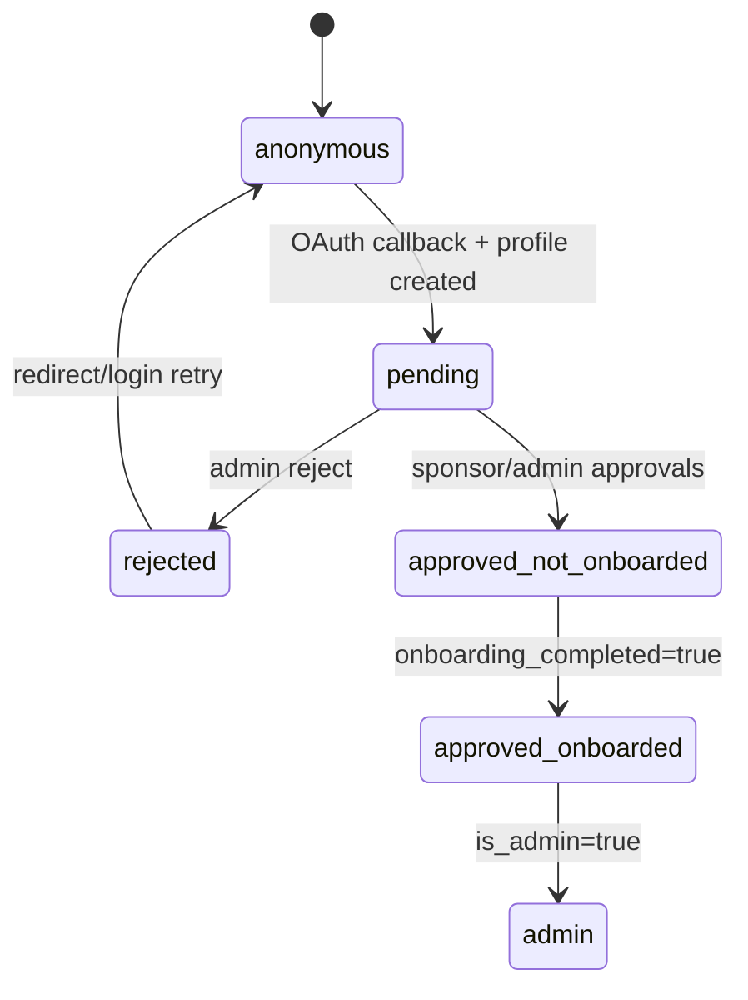
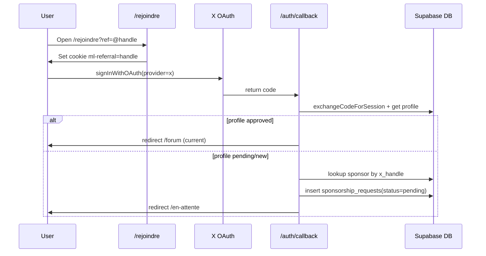
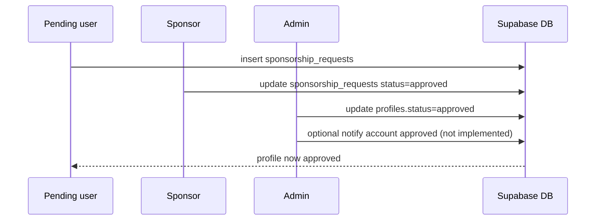

# app_flow.md

## Scope

Documentation-only route/guard/redirect inventory for current Next.js app flow and MVP target flow.
No route, redirect, middleware, or behavior change is applied here.

---

## 1) Current Route Map (observed)

### 1.1 Public and auth surface

- `/` (landing)
- `/rejoindre` (stores `ml-referral` cookie, starts X OAuth)
- `/connexion`
- `/inscription`
- `/auth/callback` (server route)
- `/en-attente` (auth required by page; also listed public in middleware)
- `/onboarding` (auth required by page/middleware state)
- Legal pages: `/cgu`, `/mentions-legales`, `/confidentialite`
- API: `/api/geo/cities`

### 1.2 App surface

- `/forum`
- `/forum/[categorySlug]`
- `/forum/posts/nouveau`
- `/forum/posts/[postId]`
- `/chat`
- `/chat/[slug]`
- `/profil`
- `/parametres`
- `/notifications`
- `/parrainages`
- `/membres`
- `/membres/[id]`
- `/admin`
- `/admin/users`
- `/tableau-de-bord`

---

## 2) Route Status Table (current + target)

| Route | Current status | Target MVP status | Notes |
| --- | --- | --- | --- |
| `/` | public | public | Landing links still point to `/forum` + `/membres`. |
| `/rejoindre` | public | public | Referral cookie bootstrap. |
| `/connexion` | public | public | Auth entry. |
| `/inscription` | public | public | X-only signup. |
| `/auth/callback` | public | public | Server OAuth handler; redirect destination currently forum-centric. |
| `/en-attente` | auth-only | auth-only | Pending/rejected handling; potential rejected UX loop/confusion. |
| `/onboarding` | member-only | member-only | Intended for approved non-onboarded users; current finish redirects to `/forum`. |
| `/chat` | member-only | member-only | MVP core destination should be this route. |
| `/chat/[slug]` | member-only | member-only | Canonical chat slug route. |
| `/profil` | member-only | member-only | Keep. |
| `/parametres` | member-only | member-only | Keep; close action currently returns to `/forum`. |
| `/notifications` | member-only | member-only | Links can still point to forum/chat query variant. |
| `/parrainages` | member-only | member-only | Sponsor/admission flow retained. |
| `/membres` | member-only | legacy | Standalone annuaire removed from active MVP product. |
| `/membres/[id]` | member-only | unknown | Used for member details + DM start; final MVP stance pending. |
| `/forum` | member-only | legacy | Not MVP destination. |
| `/forum/[categorySlug]` | member-only | legacy | Freeze first, remove later. |
| `/forum/posts/nouveau` | member-only | legacy | Onboarding still creates forum intro content. |
| `/forum/posts/[postId]` | member-only | legacy | Many links/notifications still target this. |
| `/admin` | admin-only | admin-only | Redirects non-admin to `/forum` currently. |
| `/admin/users` | admin-only | admin-only | Approval actions exist. |
| `/tableau-de-bord` | member-only | legacy | Forum-centric dashboard, not in MVP framing. |
| `/api/geo/cities` | auth-only | unknown | Called client-side from onboarding; target access policy still to decide. |
| `/cgu` | auth-only | public | Exists but middleware does not whitelist today. |
| `/mentions-legales` | auth-only | public | Exists but middleware does not whitelist today. |
| `/confidentialite` | auth-only | public | Exists but middleware does not whitelist today. |

---

## 3) Global Guards and Redirects (current)

### 3.1 Middleware (`src/lib/supabase/middleware.ts`)

- Public allowlist currently: `/`, `/connexion`, `/inscription`, `/en-attente`, `/rejoindre`, and `/auth/*`.
- If unauthenticated and route not public: redirect to `/connexion`.
- If authenticated and `status != approved`: redirect to `/en-attente`.
- If approved and not onboarded: redirect to `/onboarding`.
- If approved + onboarded on landing/auth/waiting pages: redirect to `/forum`.

### 3.2 Layout/page guards

- `(app)/layout.tsx`
  - no user -> `/connexion`
  - pending -> `/en-attente`
  - rejected -> `/connexion`
  - approved + not onboarded -> `/onboarding`
- `(app)/admin/layout.tsx`
  - non-admin -> `/forum`
- `/onboarding`
  - not auth -> `/connexion`
  - not approved -> `/en-attente`
  - already onboarded -> `/forum`
- `/en-attente`
  - rejected -> `/connexion`
  - approved -> `/forum` or `/onboarding`

---

## 4) Critical Redirect Matrix

| Source | Condition | Current destination | Target destination | Risk |
| --- | --- | --- | --- | --- |
| middleware | approved + onboarded on `/`, `/connexion`, `/inscription`, `/en-attente` | `/forum` | `/chat` | Forum remains default app entry. |
| `/auth/callback` | default path before profile checks | `/forum` | `/chat` | Forum-first fallback leaks into most login paths. |
| `/auth/callback` | approved + onboarded | `/forum` | `/chat` | Not aligned with chat-as-core MVP. |
| `/onboarding` page | onboarded profile | `/forum` | `/chat` | Hardwired forum destination. |
| onboarding wizard finish | completion success | `window.location = /forum` | `/chat` | Hard redirect to forum. |
| status poller | approved detected | `/forum` | `/chat` | Wait flow ends in forum. |
| `(app)/admin/layout` | non-admin | `/forum` | `/chat` | Role fallback routes through forum. |
| settings shell close | close action | `/forum` | `/chat` | UX fallback to forum. |
| header search result | message click | `/chat?channel=<id>` | `/chat/[slug]` | Query-style path diverges from slug routing. |
| chat mention links | notification link | `/chat?channel=<id>` | `/chat/[slug]` | Same route-shape drift as above. |

---

## 5) Current Flow Notes by Area

### 5.1 Auth + admission

- X OAuth flow goes through `/auth/callback`.
- Referral from `/rejoindre?ref=...` is stored in cookie `ml-referral`.
- Callback attempts to resolve sponsor and auto-create `sponsorship_requests`.
- Pending users are forced to `/en-attente` by middleware.

### 5.2 Sponsorship and approval

- Pending user submits sponsor handle in `SponsorRequestForm`.
- Sponsor-side requests visible in `/parrainages`.
- Admin approval/rejection in `/admin/users` via server actions.
- No explicit `account_approved` notification insertion observed in admin actions.

### 5.3 Onboarding

- Onboarding still publishes forum introduction post (`forum_posts` in `presentations` category).
- Final onboarding inserts `welcome` notification and redirects to `/forum`.
- This conflicts with forum-not-core MVP direction.

### 5.4 Navigation and links

- Sidebar top links still prioritize forum (`Forum`, `Chat`, `Annuaire`).
- Chat channel list back button points to `/forum`.
- Landing/footer links still point to `/forum` and `/membres`.
- Member detail page links to forum posts for recent activity.

### 5.5 Notifications

- Existing types actively used in UI: `chat_mention`, `forum_mention`, `forum_reply`, `sponsor_request`.
- Onboarding attempts to write `welcome`.
- Forum links appear in notification and embed flows (`/forum/posts/...`).

### 5.6 `/forum` drift inventory (explicit)

- Middleware post-login default redirect.
- Auth callback default redirect and approved redirect.
- Onboarding page redirect for completed users.
- Onboarding wizard final hard redirect.
- Status poller redirect.
- Admin non-admin redirect fallback.
- Settings shell close behavior.
- Sidebar primary nav includes `/forum` and logo points to `/forum`.
- Chat channel-list back button to `/forum`.
- Header search post results to `/forum/posts/[id]`.
- Member profile recent posts to `/forum/posts/[id]`.
- Notification helpers for forum mentions/replies use `/forum/posts/[id]`.
- Landing footer links include `/forum`.

---

## 6) `/membres` vs `/membres/[id]`

- `/membres`
  - Currently a full standalone member listing page (annuaire behavior), sourcing `profiles_public`.
- `/membres/[id]`
  - Member detail page, DM entry point, includes forum post history block.
- MVP implication
  - Standalone annuaire should not be active MVP product.
  - Member search/detail may remain as internal chat-adjacent capability (final decision pending).

---

## 7) Legal/Public Routes and `/api/geo/cities`

- Legal pages exist and should be public.
- Current middleware public list does not explicitly include `/cgu`, `/mentions-legales`, `/confidentialite`.
- `/api/geo/cities` is used by onboarding client searches; middleware treatment/publicity remains ambiguous and must be decided explicitly.

---

## 8) Mermaid Diagrams

### 8.1 Global guards and redirects (current)

```mermaid
flowchart TD
  A[Request] --> B{Authenticated?}
  B -- No --> C{Public route?}
  C -- Yes --> D[Allow]
  C -- No --> E[/connexion]

  B -- Yes --> F[Load profile: status, onboarding_completed]
  F --> G{status approved?}
  G -- No --> H[/en-attente]
  G -- Yes --> I{onboarding_completed?}
  I -- No --> J[/onboarding]
  I -- Yes --> K{path in /,/connexion,/inscription,/en-attente ?}
  K -- Yes --> L[/forum]
  K -- No --> M[Allow]
```

### 8.2 User state model (current)



### 8.3 Signup with referral cookie



### 8.4 Sponsor then admin approval



### 8.5 Target MVP navigation (forum not destination)

```mermaid
flowchart TD
  LOGIN[Auth success] --> ADMIT{approved + onboarded?}
  ADMIT -- No --> WAIT[/en-attente or /onboarding]
  ADMIT -- Yes --> CHAT[/chat]

  CHAT --> PROFILE[/profil]
  CHAT --> SETTINGS[/parametres]
  CHAT --> NOTIF[/notifications]
  CHAT --> SPONSOR[/parrainages]
  CHAT --> MEMBERS[member search/detail internal]

  FORUM[/forum/**] --> LEGACY[legacy/frozen]
```

### 8.6 Minimal notification flow (target)

```mermaid
flowchart TD
  A[System/Event] --> B{Type}
  B --> W[welcome]
  B --> SR[sponsor_request]
  B --> AA[account_approved]
  B --> CM[chat_mention]

  W --> N[(notifications)]
  SR --> N
  AA --> N
  CM --> N

  N --> UI[/notifications]
```

---

## 9) Target MVP Route Map (intended)

- Keep active: `/`, `/rejoindre`, `/connexion`, `/inscription`, `/auth/callback`, `/en-attente`, `/onboarding`, `/chat`, `/chat/[slug]`, `/profil`, `/parametres`, `/notifications`, `/parrainages`, `/admin`, `/admin/users`, legal pages.
- Legacy/frozen: `/forum/**`, `/tableau-de-bord`, and standalone annuaire behavior at `/membres`.
- Clarify explicitly whether `/membres/[id]` remains active as internal member detail.
- Primary post-auth destination: `/chat` (not `/forum`).

---

## 10) Open Questions / Ambiguities (preserved)

1. Should `/api/geo/cities` remain public or be protected?
2. Should `invitations` remain active after sponsorship consolidation?
3. Should `message_reactions` remain part of MVP?
4. Should `chat_mention` be the only mention type retained (vs forum mention types)?
5. Should `/membres/[id]` remain active after standalone annuaire removal?

---

## 11) Explicit Statement

- `/forum` is NOT the MVP destination.
- This document records current behavior and target direction only.
- No redirect, route, navigation, middleware, or runtime behavior was changed in this session.
