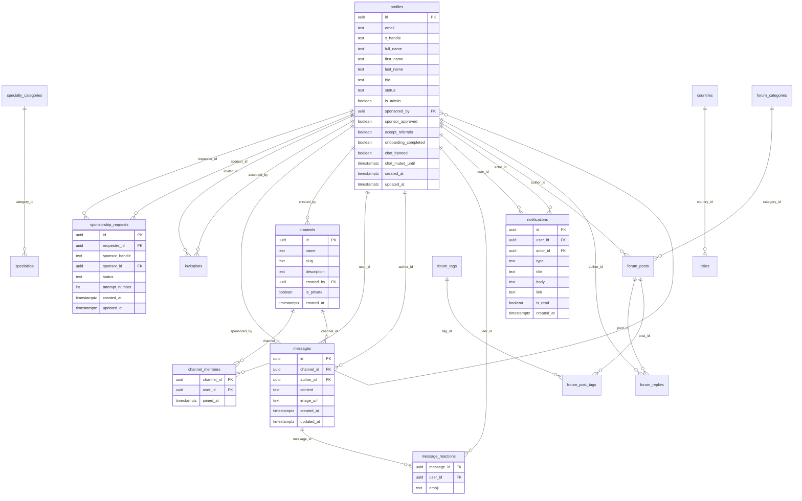

# db_flow.md

## Scope

Documentation-only snapshot of the current Supabase DB/RLS state, plus the MVP target shape.
No migration is applied here.

---

## 1) Current Supabase Schema (from migrations)

### 1.1 Core identity and admission

- `profiles`
  - PK: `id -> auth.users(id)`
  - Key fields: `status`, `is_admin`, `x_handle`, `sponsored_by`, `sponsor_approved`, `onboarding_completed`, `accept_referrals`, `accept_sponsorship`, `accept_dms`, `chat_banned`, `chat_muted_until`, `hidden_channel_ids`
  - Extra profile fields: `first_name`, `last_name`, `bio`, `location`, `specialty_ids`, `specialty_category_id`, `specialty_category_ids`, `visibility`, `looking_for`, etc.
- `sponsorship_requests`
  - PK: `id`
  - FKs: `requester_id -> profiles.id`, `sponsor_id -> profiles.id`
  - Constraints: `status in (pending, approved, rejected)`, `attempt_number between 1 and 2`
  - Index: unique `(requester_id, attempt_number)`
- `invitations`
  - PK: `id`
  - FKs: `inviter_id -> profiles.id`, `accepted_by -> profiles.id`
  - Constraints: `status in (pending, accepted, rejected)`, unique `(inviter_id, invited_x_handle)`

### 1.2 Chat

- `channels`
  - PK: `id`
  - Fields: `name`, `slug`, `description`, `created_by`, `is_private`, `created_at`
  - Uniques: `name`, `slug`
- `channel_members`
  - PK: `(channel_id, user_id)`
  - FKs: `channel_id -> channels.id`, `user_id -> profiles.id`
- `messages`
  - PK: `id`
  - FKs: `channel_id -> channels.id`, `author_id -> profiles.id`
  - Fields: `content`, `image_url`, `created_at`, `updated_at`
  - Index: `idx_messages_channel_created(channel_id, created_at desc)`
  - Index: `idx_messages_search` full-text on `content`
- `message_reactions`
  - PK: `(message_id, user_id, emoji)`
  - FKs: `message_id -> messages.id`, `user_id -> profiles.id`

### 1.3 Notifications

- `notifications`
  - PK: `id`
  - FKs: `user_id -> profiles.id`, `actor_id -> profiles.id`
  - Fields: `type`, `title`, `body`, `link`, `is_read`, `created_at`
  - Type check currently allows: `chat_mention`, `forum_mention`, `forum_reply`, `sponsor_request`
  - Index: `idx_notifications_user_unread(user_id, is_read, created_at desc)`

### 1.4 Member directory / taxonomy / geo

- `specialty_categories` (PK `id`, unique `name`, `sort_order`)
- `specialties` (PK `id`, FK `category_id -> specialty_categories.id`, unique `(category_id, name)`)
- `countries` (PK `id`, unique `name`, unique `code`)
- `cities` (PK `id`, FK `country_id -> countries.id`, unique `(name, country_id)`, indexes on `country_id` and `name`)

### 1.5 Forum (legacy candidate for MVP)

- `forum_categories` (PK `id`, unique `slug`, includes `is_introduction`)
- `forum_tags` (PK `id`, unique `name`)
- `forum_posts` (PK `id`, FK `category_id`, FK `author_id`, `is_pinned`, `is_locked`, `reply_count`, `last_reply_at`)
- `forum_post_tags` (PK `(post_id, tag_id)`)
- `forum_replies` (PK `id`, FK `post_id`, FK `author_id`)

### 1.6 Other legacy/support

- `channel_proposals`, `channel_votes`
- `user_reports`, `user_blocks`
- Historical dropped tables in migration history: `annonces`, `offres_emploi`

### 1.7 Functions, triggers, realtime

- Functions found
  - `public.handle_updated_at()`
  - `public.handle_new_user()` (redefined multiple times)
  - `public.is_admin()`
  - `public.update_sponsorship_requests_updated_at()`
  - `public.handle_new_forum_reply()`
- Triggers found
  - `set_profiles_updated_at`, `set_invitations_updated_at`, `set_messages_updated_at`, `set_forum_posts_updated_at`, `set_forum_replies_updated_at`, `set_sponsorship_requests_updated_at`
  - `on_auth_user_created` on `auth.users`
  - `on_forum_reply_created`
- Realtime publication
  - `public.messages`
  - `public.notifications`

---

## 2) Current RLS / Permission Inventory

Enabled RLS on key tables: `profiles`, `invitations`, `channels`, `messages`, `message_reactions`, `forum_*`, `notifications`, `sponsorship_requests`, `channel_members`, `user_reports`, `user_blocks`, `specialty_*`.

### 2.1 Explicit P0 risk review (required tables)

- `profiles` (HIGH)
  - Self-update policy (`id = auth.uid()`) does not column-restrict sensitive fields.
  - Risk: user may update `status`, `is_admin`, `sponsored_by`, `sponsor_approved`, `chat_banned`, `chat_muted_until` unless DB-level guard exists.
- `sponsorship_requests` (HIGH)
  - Insert policy only checks `requester_id = auth.uid()`.
  - Risk: can set non-pending status, arbitrary `sponsor_id`, self-sponsor, inconsistent attempt semantics.
- `invitations` (MEDIUM/HIGH)
  - Insert checks approved profile, but does not enforce `inviter_id = auth.uid()` in `WITH CHECK`.
  - Risk: creating invitations on behalf of another user.
- `channels` (MEDIUM/HIGH)
  - Approved users can insert channels (policy is not restricted to private-only); admin policy is broad for all ops.
  - MVP requires stricter admin-only channel creation for public channels.
- `channel_members` (HIGH)
  - Insert policy allows any approved user to insert memberships.
  - Risk: arbitrary join/add to private channels.
- `messages` (HIGH)
  - Insert policy checks approved author and `author_id = auth.uid()`.
  - Missing explicit Jobs write restriction and explicit membership check for private channels on insert.
- `message_reactions` (MEDIUM/HIGH)
  - Policies check approved user only, not message/channel visibility.
  - Risk: reaction leakage in private channels.
- `notifications` (MEDIUM)
  - Insert now constrained to `actor_id = auth.uid()` (good improvement vs previous wide-open policy).
  - Still allows actor to notify any `user_id`; may be acceptable for app-triggered writes but should be constrained by notification type policy.

### 2.2 Additional risks

- `profiles_public` is queried by app code but no `CREATE VIEW profiles_public` was found in migrations.
  - Risk: environment drift or undocumented manual DB object.
- Notification type drift:
  - App uses `welcome` in onboarding, but DB check constraint does not include `welcome`.
  - Risk: insert failure at onboarding finish.
- Policy layering risk:
  - Multiple historical policies may overlap and produce broader access than intended.

### 2.3 Policy inventory (current names)

- `profiles`
  - `Users can view approved profiles`
  - `Users can update own profile`
  - `Admins can update any profile`
  - `Sponsors can view their sponsored users`
  - `Sponsors can approve their sponsored users`
- `sponsorship_requests`
  - `Requesters can view own requests`
  - `Requesters can create requests`
  - `Sponsors can view requests for them`
  - `Sponsors can update requests for them`
  - `Admins can view all sponsorship requests`
  - `Admins can update all sponsorship requests`
- `invitations`
  - `Users can view own invitations`
  - `Approved users can create invitations`
  - `Invited users can update invitation status`
- `channels`
  - `Approved users can view channels`
  - `Admins can manage channels`
  - `Approved users can create private channels`
- `channel_members`
  - `Users can view own channel memberships`
  - `Users can view co-members in their channels`
  - `Approved users can create channel memberships`
- `messages`
  - `Approved users can view messages`
  - `Approved users can send messages`
  - `Users can update own messages`
  - `Users can delete own messages`
- `message_reactions`
  - `Approved users can view reactions`
  - `Users can add reactions`
  - `Users can remove own reactions`
- `notifications`
  - `Users can read own notifications`
  - `Users can update own notifications`
  - `Authenticated users can insert own notifications`

---

## 3) Table Classification Matrix

| Table / Object | Class | Notes |
| --- | --- | --- |
| `profiles` | adapt | Core MVP table; needs sensitive-column protection and status/admin hardening. |
| `sponsorship_requests` | adapt | Core admission flow; needs stricter insert/update checks. |
| `invitations` | archive later | Still used in app; keep for now, evaluate deprecation after sponsorship consolidation. |
| `channels` | adapt | Keep chat channels; enforce MVP channel governance. |
| `channel_members` | adapt | Keep for DM/private membership, but tighten insert rules. |
| `messages` | adapt | MVP core; add Jobs/admin-only write behavior and moderation fields if retained. |
| `message_reactions` | adapt | Keep only if reactions remain in MVP; add channel visibility checks. |
| `notifications` | adapt | Keep minimal set and system-safe creation patterns. |
| `countries` | keep | Used by onboarding geo flows. |
| `cities` | keep | Used by `/api/geo/cities` fallback query. |
| `specialty_categories` | keep | Used by onboarding/profile/members filtering. |
| `specialties` | keep | Used by onboarding/profile/members filtering. |
| `forum_categories` | archive later | Forum is not active MVP product. Freeze, do not destroy now. |
| `forum_tags` | archive later | Same as above. |
| `forum_posts` | archive later | Same as above. |
| `forum_post_tags` | archive later | Same as above. |
| `forum_replies` | archive later | Same as above. |
| `channel_proposals` | archive later | Not MVP core. |
| `channel_votes` | archive later | Not MVP core. |
| `user_reports` | unknown | Existing moderation support; not MVP-core in current framing. |
| `user_blocks` | unknown | Existing safety support; not MVP-core in current framing. |
| `auth.users` | keep | Upstream auth source of truth. |
| `profiles_public` (view) | unknown | Referenced by app, not found in migrations; document and audit. |
| Historical `annonces`, `offres_emploi` | archive later | Already dropped in migration history; keep as historical note only. |

---

## 4) ERD (Current-focused, real names)

---

## 5) Target MVP Schema (separate from current)

### 5.1 Keep and harden

- `profiles`: same core identity table, but stricter write controls for sensitive fields.
- `sponsorship_requests`: one active sponsorship path for admission.
- `channels`, `channel_members`, `messages`, `notifications` remain core.
- `message_reactions`: keep only if explicitly retained in MVP.
- `countries`, `cities`, `specialty_categories`, `specialties` remain if onboarding/profile UX depends on them.

### 5.2 Freeze / legacy

- Forum tables (`forum_*`) become legacy/frozen (not MVP destination).
- `channel_proposals`, `channel_votes`, `invitations` are legacy candidates; defer destructive actions.

### 5.3 Target-only constraints and behaviors

- Profiles
  - Self-update must exclude sensitive privilege/admission columns.
  - Status/admin mutations must be admin-only and auditable.
- Sponsorship
  - Insert must force `status = 'pending'`, `requester_id = auth.uid()`, no self-sponsor.
  - Enforce at most one active request (or exact approved business rule) per requester.
- Chat
  - Jobs channel write admin-only; read for approved members.
  - Private channel message/read/write must enforce membership consistently.
  - Moderation-ready fields (`is_pinned`, soft-delete/edit columns) if validated by downstream task.
- Notifications
  - Align DB `type` enum with minimal MVP set: `welcome`, `sponsor_request`, `account_approved`, `chat_mention` (if present in app).
  - Restrict insert patterns to expected actor/target semantics.

---

## 6) Required Migrations (identified only, not applied)

1. Admin bootstrap migration with guardrails for exactly the 2 existing admin profiles.
2. Profiles hardening migration:
   - Split safe self-update columns from admin-only columns.
   - Restrict writes to `status`, `is_admin`, `sponsored_by`, `sponsor_approved`, `chat_banned`, `chat_muted_until`.
3. Sponsorship request constraints:
   - Active-request uniqueness strategy.
   - Anti self-sponsor check/trigger.
   - Insert normalization to pending-only requester-owned rows.
4. Invitations guard (if table remains active): enforce `inviter_id = auth.uid()`.
5. Channel/member/message RLS hardening:
   - Prevent arbitrary private membership insertion.
   - Enforce membership for private channel message access and writes.
   - Enforce Jobs channel admin-write rule.
6. Notification type alignment:
   - Add/align `welcome`, `account_approved`, and retain `sponsor_request`, `chat_mention` as needed.
7. Optional moderation fields on `messages` (`is_pinned`, soft-delete/edit columns) once `TASK_09` confirms final shape.
8. Channel bootstrap alignment:
   - confirm and seed minimal MVP channels set (`general`, `business`, `politique`, `divers`, `jobs`) with idempotent migration.
9. Optional ordering field on channels (`sort_order`) if deterministic order is required.
10. Add/commit documented definition for `profiles_public` view (or remove runtime dependency) to eliminate schema drift.

---

## 7) Grants / Policy Notes

- No explicit `GRANT` statements were found in these migrations; access control is primarily via RLS policies.
- Realtime publication currently includes only `messages` and `notifications`.

---

## 8) Deferred Destructive Changes

Destructive DB actions are explicitly deferred:

- No table drops for forum/legacy areas in this documentation step.
- No schema cleanup migration is applied here.
- Legacy objects stay until implementation sessions validate safe removal.
