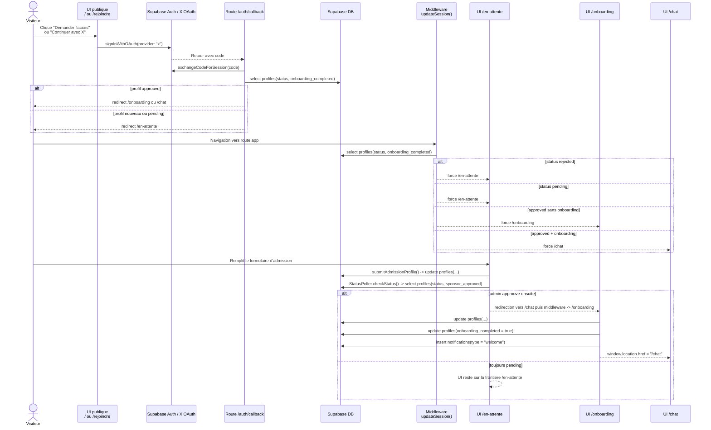
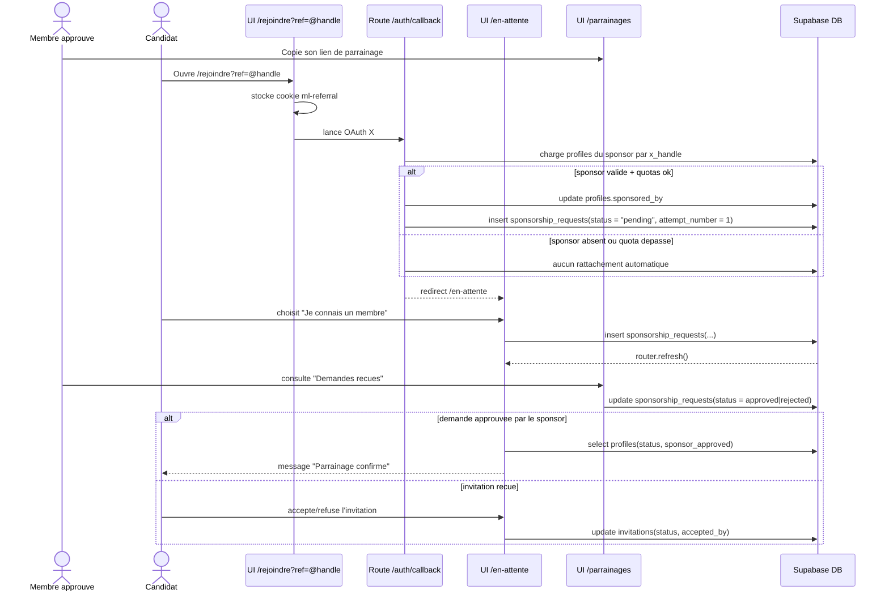
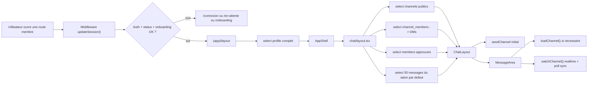
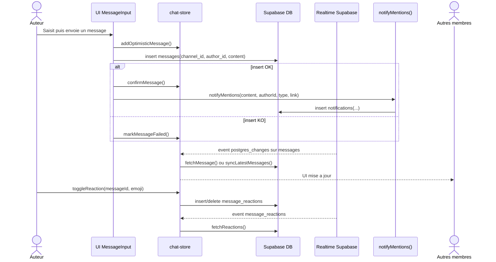
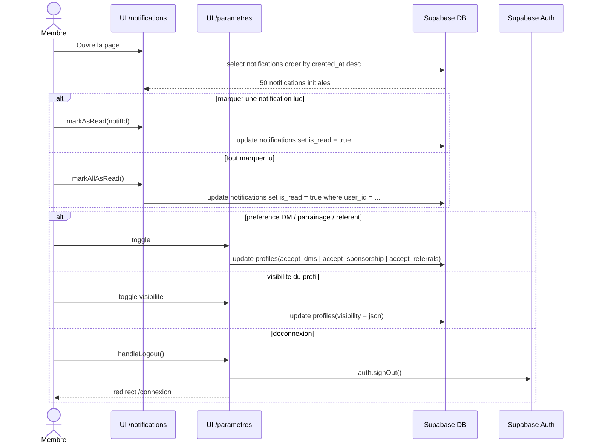
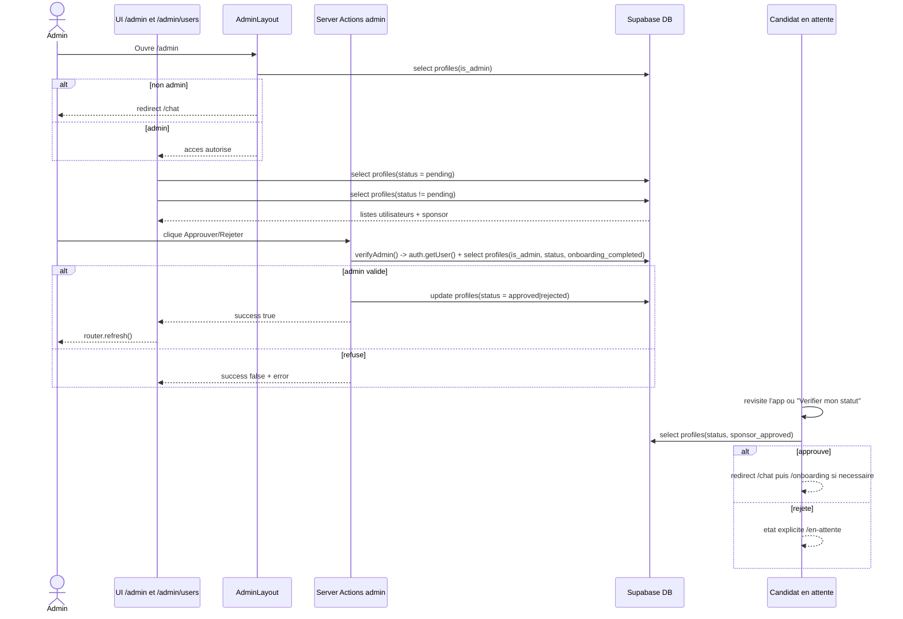
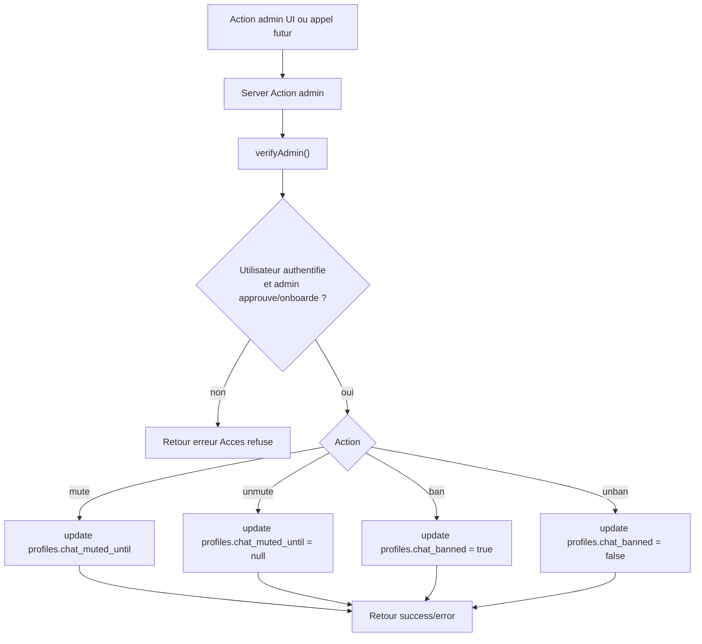

# Architecture actuelle - UI / serveur / DB

Diagrammes Mermaid des grands blocs fonctionnels actuels de l'app.

Portee:
- base sur le code actuel, pas sur le scope PRD theorique
- centre sur les interactions UI, routes/server actions et Supabase
- utile pour comprendre les evenements, methodes et tables touchees

Sources principales:
- `src/lib/supabase/middleware.ts`
- `src/app/auth/callback/route.ts`
- `src/app/(auth)/en-attente/page.tsx`
- `src/app/(auth)/en-attente/actions.ts`
- `src/app/onboarding/page.tsx`
- `src/components/onboarding/onboarding-wizard.tsx`
- `src/app/(app)/layout.tsx`
- `src/app/(app)/chat/layout.tsx`
- `src/components/chat/*`
- `src/app/(app)/parametres/page.tsx`
- `src/app/(app)/notifications/page.tsx`
- `src/app/(app)/admin/*`
- `src/components/sponsorship/*`

## 1. Acces, admission, onboarding et croissance

Points d'entree et methodes cles:
- `AccessModal` -> `OAuthButtons`
- `RejoindrePage.handleSignUp()`
- `/auth/callback` -> `exchangeCodeForSession()`
- `updateSession()` dans le middleware
- `submitAdmissionProfile()`
- `StatusPoller.checkStatus()`
- `SponsorRequestForm.handleSubmit()`
- `InvitationCard.handleAction()`
- `OnboardingWizard.finish()`

### 1.1 Entree publique -> OAuth X -> admission -> onboarding

### 1.2 Parrainage, invitation et rattachement sponsor

## 2. Experience membre et parametres

Points d'entree et methodes cles:
- `(app)/layout` pour la frontiere membre
- `ChatLayoutPage` cote serveur
- `ChatStore.loadChannel()`, `watchChannel()`, `loadOlderMessages()`
- `MessageInput.sendMessage()`
- `notifyMentions()`
- `NotificationsList.markAsRead()` / `markAllAsRead()`
- `ParametresPage.handleToggleDms()` / `handleToggleVisibility()` / `handleLogout()`

### 2.1 Frontiere membre et chargement du chat

### 2.2 Message chat, reactions, mentions et sync realtime

### 2.3 Notifications et parametres

## 3. Administration

Points d'entree et methodes cles:
- `AdminLayout`
- `verifyAdmin()`
- `approveUser()` / `rejectUser()`
- `ApproveRejectButtons.handleAction()`
- `muteUser()` / `unmuteUser()`
- `banFromChat()` / `unbanFromChat()`

### 3.1 Acces admin et validation des candidats

### 3.2 Moderation chat cote serveur

## Notes de lecture

- Les diagrammes montrent l'architecture actuelle, y compris le lien de mention chat en `/chat?channel=...` dans `notifyMentions()`.
- La frontiere d'acces existe a deux niveaux:
  - middleware global `updateSession()`
  - layouts serveur `(app)` et `admin`
- Le chat combine:
  - prechargement serveur du salon par defaut
  - cache local `chat-store`
  - subscriptions realtime Supabase
  - polling de resynchronisation toutes les 5 secondes
