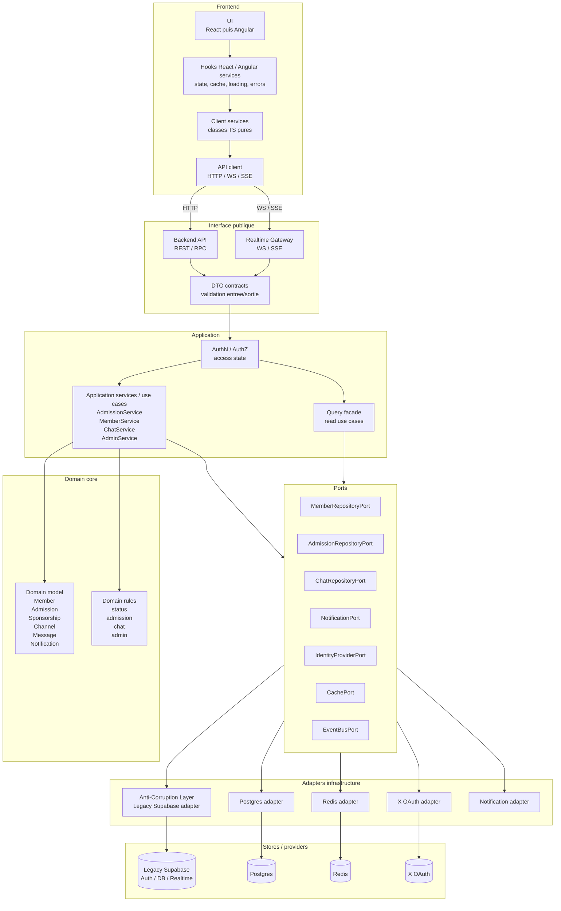
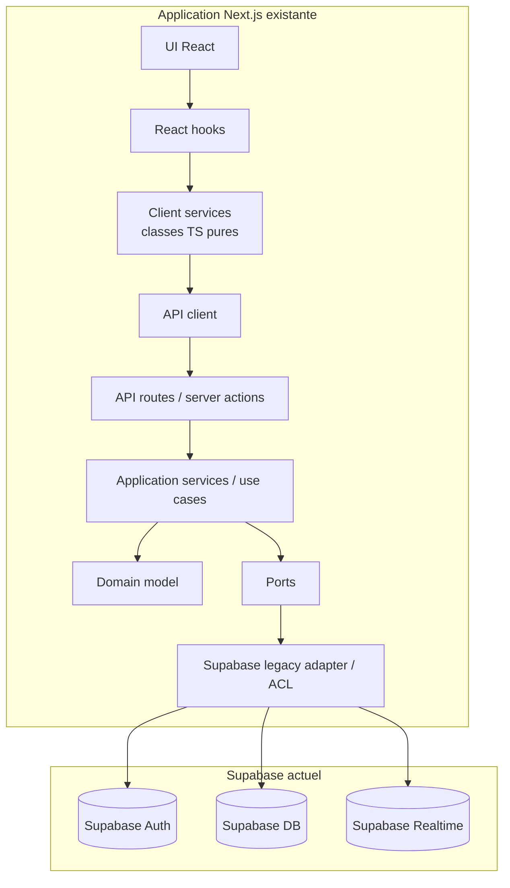
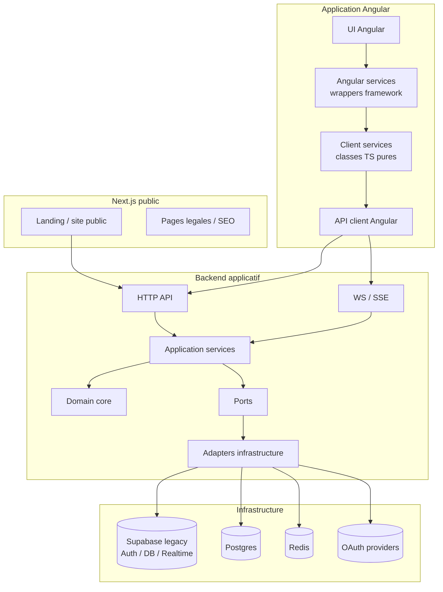

# Architecture future - front / API / services / adapters

Diagrammes Mermaid des blocs cibles pour une migration vers une architecture pseudo DDD / pseudo hexagonale.

## Vue cible logique



## Vue transitoire dans Next.js



## Vue separee backend + Angular



## Flux de dependances

```text
UI
  -> React hooks / Angular services
    -> Client services, classes TS pures
      -> API client
        -> Backend API
          -> Application services / use cases
            -> Domain model
            -> Ports
              -> Adapters
                -> Supabase aujourd'hui
                -> Postgres / Redis / autre demain
```
