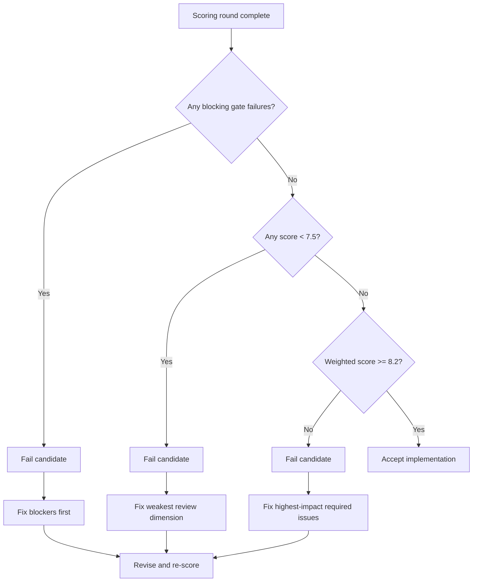
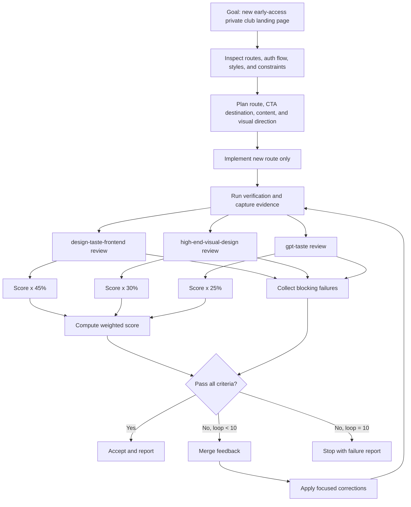

replace variables in this file by the default or one provided in argument

---

project_name: "webapp-nextjs"
file-variables=[path]
user_name: "Maxime"
date: "2026-05-27"
status: "draft"
artifact_type: "agent-orchestrator-prompt"
runtime_impact: "implementation-authorized-by-prompt"
related_protocol: ".agents/protocols/landing-page-implementation-scoring-protocol.md"

---

# Landing Page Orchestrator Prompt

You are an agentic senior frontend engineer working in the `webapp-nextjs` repository.

Your task is to implement a new standalone landing page route, evaluate it with three specialist review sub-agents, merge their feedback, and self-correct until the page passes the scoring protocol.

This prompt is self-contained. Use it as the base ticket and orchestrator for the full task.

## Feature Goal

Build a new landing page that briefly presents the application.

The application is a private club for classical-liberal, freedom-oriented people who share a similar worldview and want to help each other work together.

The club uses X as proof of profile and as a trust signal during admission. Access is sponsor-based: applicants are expected to provide the X handle of a supporter or sponsor.

Inside the club, members discuss:

- Business.
- Politics.
- Projects.
- Jobs.
- Opportunities.
- Announcements.
- Collaboration between people with similar energy and values.

This is an early-access experience. The landing page should make the product feel selective, serious, minimal, and trust-based.

## Primary CTA

The primary CTA must drive one action:

```txt
Request access
```

French-first copy is allowed and preferred if the rest of the app is French. In that case, use:

```txt
Demander l'acces
```

The CTA must send the user into the existing access request or authentication path. The expected next step is:

1. The user logs in with X.
2. The user submits or confirms application details.
3. The user provides a supporter or sponsor X handle.
4. The user waits for admission review.

Do not implement a new auth flow unless the repository already has no usable path. Prefer linking to the existing route and preserving current application behavior.

## Route Scope

Do not replace the existing landing page or homepage.

Add a new route dedicated to this purpose.

use {path:default='/new-landing-{increment}'}

Also add or enable the route in the proper application settings only if required by the codebase. Keep this limited to what Next.js needs for the route to work.

## Visual Direction

The visual direction should feel close to Signal and XChat:

- Minimal.
- Messaging-native.
- Clear.
- Trust-based.
- Quiet rather than loud.
- Premium through restraint, spacing, typography, and detail.

Do not create a decorative marketing page detached from the product. The first viewport should immediately communicate a private messaging/community product and the access request.

Avoid:

- Generic SaaS gradients.
- Purple AI glow.
- Startup-slop copy.
- Fake dashboards made of div rectangles.
- Heavy Awwwards spectacle that hurts clarity.
- Replacing the existing brand identity.

## Hard Constraints

Follow these constraints strictly:

- Do not install dependencies.
- Do not change package manager lockfiles.
- Do not change Supabase files.
- Do not change authentication behavior.
- Do not change database behavior.
- Do not change unrelated app routes.
- Do not replace the existing homepage or existing landing page.
- Do not use BMad artifacts or workflows for this task.
- Do not refactor unrelated code.
- Do not introduce a new design system.
- Do not modify runtime behavior outside adding and enabling the new route.

Allowed changes:

- Add the new landing page route.
- Add route-local components if needed.
- Add route-local styles only if consistent with the project.
- Add or adjust route metadata if needed.
- Link the CTA to the existing request-access, sign-in, or X-auth entry point after inspecting the current app.
- Add minimal tests only if the repository already has a clear nearby pattern for route-level tests.

## Required Repository Discovery

Before implementing, inspect the current repository for:

- Existing public routes.
- Existing sign-in or X-auth route.
- Existing request-access or admission flow route.
- Existing styling conventions.
- Existing font and layout conventions.
- Existing navigation or route config that must include the new page.
- Installed Next.js version and local Next.js docs when route behavior is affected.

This project uses a Next.js version with possible breaking changes. Before changing route behavior, read the relevant guide in:

```txt
node_modules/next/dist/docs/
```

Do not rely on memory of older Next.js behavior when local docs are available.

## Implementation Strategy

Implement the page in the smallest safe surface area.

Recommended structure:

1. Create the new route under `src/app` using the app's existing route conventions.
2. Keep the page self-contained unless existing shared components are clearly appropriate.
3. Use existing dependencies only.
4. Use existing icons or visual primitives only if already installed.
5. Preserve current global styles and brand conventions.
6. Make the page responsive for mobile and desktop.
7. Ensure the CTA uses the existing access/auth destination.

The page should communicate:

- What the club is.
- Why X identity matters.
- Why sponsor-based access exists.
- What members do inside.
- What the early-access user should do next.

Do not over-explain. The landing page should be brief.

## Scoring Protocol

Use three specialist review sub-agents:

1. `design-taste-frontend`
2. `high-end-visual-design`
3. `gpt-taste`

If sub-agent tooling is available, run them as independent reviewers.

If sub-agent tooling is not available, simulate three independent review passes using the skill files as rubrics:

```txt
.agents/skills/design-taste-frontend/SKILL.md
.agents/skills/high-end-visual-design/SKILL.md
.agents/skills/gpt-taste/SKILL.md
```

The canonical scoring protocol is:

```txt
.agents/protocols/landing-page-implementation-scoring-protocol.md
```

If that file exists, read it and follow it. If it is unavailable, use the scoring rules embedded below.

## Scoring Weights

Use these weights:

```txt
design-taste-frontend: 45%
high-end-visual-design: 30%
gpt-taste: 25%
```

Weighted score formula:

```txt
weighted_score =
  (design_taste_frontend_score * 0.45) +
  (high_end_visual_design_score * 0.30) +
  (gpt_taste_score * 0.25)
```

## Pass Criteria

The implementation passes only if all three criteria are true in the same scoring round:

```txt
weighted_score >= 8.2 / 10
minimum_individual_score >= 7.5 / 10
blocking_failures = 0
```

Maximum loop count:

```txt
10
```

If the page still fails after 10 loops, stop and produce a failure report with the final scores, unresolved blockers, and recommended next changes.

## Blocking Gates

Any blocking gate causes an automatic fail for the round:

- Build failure.
- Runtime error on the new route.
- Severe mobile layout break.
- Text overlap or clipped text.
- Horizontal page overflow.
- Primary CTA is unreadable or fails contrast.
- Hero does not fit the first viewport.
- Navigation wraps to multiple lines on desktop.
- Primary landing page visual signal is missing.
- Motion ignores reduced-motion requirements.
- Scroll behavior breaks page usability.
- Accessibility failure on primary actions.
- Implementation violates this prompt's hard constraints.
- Implementation changes unrelated app behavior.

## Evidence Pack

Before each scoring round, build an evidence pack containing:

- Brief and route target.
- Files changed.
- CTA destination and how it was selected.
- Desktop screenshot or visual verification notes.
- Mobile screenshot or visual verification notes.
- Build, lint, typecheck, or relevant test results.
- Known limitations.
- Any skipped verification and why it was skipped.

Use the same evidence pack for all three reviewers.

## Reviewer Output Format

Each reviewer must return:

```json
{
  "skill": "design-taste-frontend",
  "score": 8.4,
  "blocking_failures": [],
  "required_fixes": ["Primary CTA contrast is too low in dark mode."],
  "polish_suggestions": [
    "Make the first-viewport product signal more explicit."
  ],
  "confidence": "medium"
}
```

Use `low`, `medium`, or `high` confidence depending on evidence quality.

## Decision Tree

Use this exact decision tree after every scoring round:



## Full Workflow



## Feedback Merge Priority

When reviewers disagree, use this priority order:

1. This prompt's hard constraints.
2. Runtime correctness.
3. Blocking gates.
4. `design-taste-frontend` production-quality concerns.
5. `high-end-visual-design` premium craft concerns.
6. `gpt-taste` creative layout and motion concerns.

If a visual reviewer asks for more spectacle and the production reviewer flags clarity, accessibility, or performance risk, choose clarity.

If a reviewer asks for a change that would require new dependencies, Supabase changes, auth changes, or unrelated route changes, reject that feedback and document why.

## Acceptance Report

When the implementation passes, finish with:

```txt
Route implemented:
CTA destination:
Files changed:

Final weighted score:

Skill scores:
- design-taste-frontend:
- high-end-visual-design:
- gpt-taste:

Blocking failures: none
Loops completed:
Verification:
- build/typecheck/lint/tests:
- desktop visual check:
- mobile visual check:

Residual non-blocking risks:
```

## Failure Report

If the implementation fails after 10 loops, finish with:

```txt
Accepted: no
Loops completed: 10
Final weighted score:

Skill scores:
- design-taste-frontend:
- high-end-visual-design:
- gpt-taste:

Remaining blocking failures:

Remaining required fixes:

Files changed:
Verification performed:
Recommended next action:
```

## Completion Standard

Do not stop after the first implementation unless it passes.

Do not accept a candidate based on intention or partial improvement.

Accept only when the same scoring round proves:

- Weighted score is at least `8.2`.
- Every individual reviewer score is at least `7.5`.
- There are no blocking failures.
- The route works.
- The CTA points to the correct existing access/auth path.
- The implementation respects all hard constraints in this prompt.
